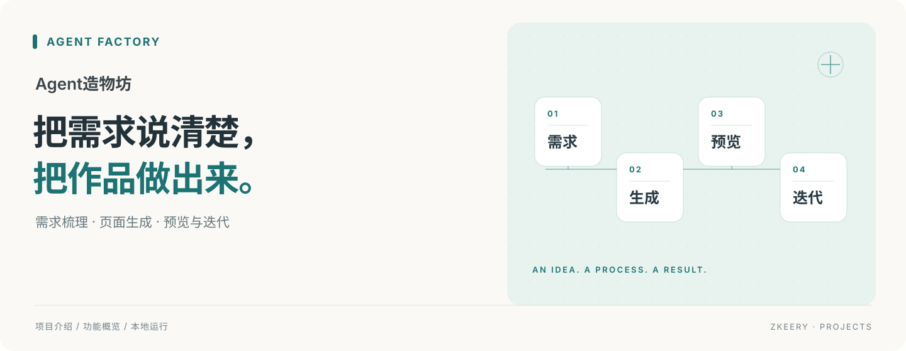

# Agent造物坊

**把一个产品想法，推进到可以在本机试用的小应用。**

面向想验证产品点子的创作者与产品经理。用对话澄清需求，确认产品说明和验收场景，再让开发与验证 Agent 协作构建；你负责关键决策和最终试用。

[快速开始](#快速开始) · [运行边界](docs/PRD/版本/V1.2/技术文档/技术架构与运行边界.md) · [更多文档](docs/README.md)

## 可以做什么

- **把想法问清楚**：逐题澄清用户、问题与范围，生成可修改的 PRD 和验收场景。
- **构建并检查应用**：开发与验证角色分工执行，记录进度和检查结果，在限制内修复问题。
- **试用后继续迭代**：打开本地成品，按场景记录通过或失败；保留问题，生成修复版本。
- **管理项目与交付**：切换历史版本、删除与恢复项目，人工验收通过后导出交付包。

## 从想法到试用

1. 输入想做的工具，回答关键问题。
2. 检查右侧产品说明，保存验收场景并确认需求。
3. 开始构建，查看检查结果，按提示确认本地运行。
4. 打开成品逐项试用；不通过就记录问题继续修复，通过后再交付。

## 快速开始

准备 Python 3.12、Node.js 24。以下命令适用于 macOS / Linux：

```bash
git clone https://github.com/Zkeery/agent-factory.git
cd agent-factory
cp backend/.env.example backend/.env
python3.12 -m venv backend/.venv
backend/.venv/bin/pip install -r backend/requirements.txt
npm --prefix frontend install
bash scripts/dev-up.sh
```

打开[本地工作台](http://127.0.0.1:3010)。本地登录使用模拟短信，验证码会显示在页面；后端端口为 `8010`。

默认 `LLM_PROVIDER=mock`，可以不填 Key 体验占位演示流程。要使用真实模型，在 `backend/.env` 将其改为 `deepseek`，填写自己的 `LLM_API_KEY`，然后重启后端。真实模型调用会产生费用。

## 当前范围

这是本地 MVP，采用 Next.js + FastAPI + SQLite。自动检查通过后仍需人工验收；Mock 产物不代表真实模型效果。成品预览会在本机启动进程，尚不具备面向不可信用户的完整隔离。当前没有公网生产部署，真实短信服务也尚未接入。

## 文档与代码

[配置示例](backend/.env.example) · [文档导航](docs/README.md) · [Agent 协作说明](docs/PRD/版本/V1.2/技术文档/Agent协作与项目复盘.md)

前端在 `frontend/`，后端在 `backend/`，启动脚本在 `scripts/`；需求、技术方案与验证记录统一放在 `docs/`。
