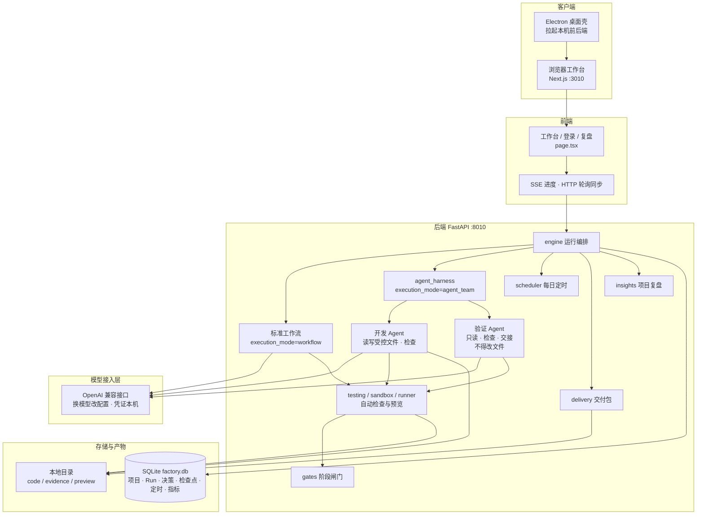
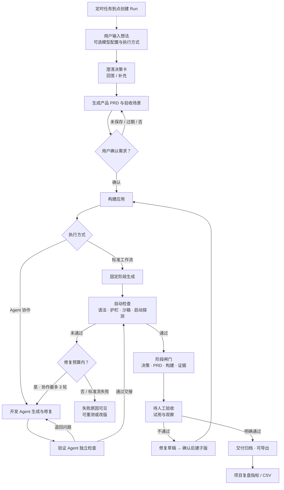

# Agent造物坊 产品需求文档（PRD）

| 文档属性 | 内容 |
| --- | --- |
| 产品名称 | Agent造物坊 |
| 产品版本 | V1.2 |
| 文档负责人 | 小龙兰 |
| 更新日期 | 2026-10-06（含系统架构图） |
| 文档用途 | 定义产品范围、业务规则、功能需求及验收标准 |
| 适用范围 | 本地产品工作台及其生成、验证、迭代和交付流程 |
| 配套文档 | [技术架构与运行边界](技术文档/技术架构与运行边界.md)、[版本文档索引](README.md) |

## 1. 产品概述

### 1.1 产品定位

Agent造物坊是面向产品经理、独立创作者和开发者的小应用制作工作台。用户提交产品想法，通过需求澄清、需求确认、应用构建和实际试用，获得可在本地运行的应用及配套交付资料。

产品以项目组织成果，以版本保留修改过程。自动执行负责生成与技术检查，用户负责需求决策和业务验收。

### 1.2 产品目标

| 目标 | 对应要求 |
| --- | --- |
| 使需求可执行 | 将想法转化为明确的功能范围、输入输出及具体验收任务 |
| 使结果可验证 | 提供启动说明、预览入口、自动检查结果和人工试用记录 |
| 使修改可追溯 | 基于已有成品创建新版本，保留原版本的需求、代码和验收记录 |
| 使过程可管理 | 展示当前阶段、待处理动作、失败原因、执行记录与成本估算 |

交付完成以用户明确通过业务验收为准。代码生成完成、自动检查通过、预览可打开均不单独构成交付完成。

### 1.3 产品范围

| 纳入 V1.2 的范围 | 不纳入 V1.2 的范围 |
| --- | --- |
| 产品想法录入、逐题澄清、需求补充和 PRD 确认 | 通用附件解析、知识库与检索增强系统 |
| 标准工作流及开发、验证 Agent 协作 | 任意外部代码仓库导入与自动迁移 |
| 本地应用构建、检查、预览及交付包 | 公网自动部署、云端持续运行与发行渠道建设 |
| 人工验收、修复草稿和父子版本迭代 | 以自动检查代替人工业务验收 |
| 项目管理、回收站、每日定时创建和项目复盘 | 企业协作权限、多租户生产隔离与商业化计费 |
| 工厂运行、耗时及估算成本统计 | 生成应用内部的用户增长、行为和留存统计 |

## 2. 用户角色与使用场景

### 2.1 用户角色

| 用户角色 | 主要任务 | 所需信息 |
| --- | --- | --- |
| 产品经理、独立创作者 | 明确需求、试用应用、记录问题并提出修改 | 当前问题、待处理动作、产品需求和应用成果 |
| 开发者、技术协作者 | 检查实现、复现执行过程、定位失败原因 | 代码、日志、工具记录、检查结果和执行限制 |

产品视图和开发视图属于同一用户的数据展示方式，不构成独立角色权限。切换视图不得改变项目、版本或执行方式。

### 2.2 使用场景

| 场景 | 用户输入 | 预期结果 |
| --- | --- | --- |
| 制作工作提效工具 | 材料处理需求、输入样例及输出要求 | 能完成指定处理任务的本地应用 |
| 验证小产品想法 | 计算器、记录器、清单或轻量生成工具的想法 | 具备可试用主路径的第一版应用 |
| 修改已有成品 | 新需求或实际试用中发现的问题 | 继承父版上下文的新版本及独立验收记录 |
| 每日定时发起制作 | 产品想法和每日触发时间 | 到点创建新运行，进入相应执行阶段或等待用户处理 |

首页模板用于辅助填写想法，用户可编辑后提交。模板名称不代表独立的专用生成能力。

### 2.3 使用前提

用户通过手机号和验证码登录。登录失败时显示原因并允许重新输入；登录成功后加载当前账号的项目和任务。真实生成前须具备可用的模型配置，本地构建和预览须满足对应运行环境要求。

## 3. 输入、过程与产物

本节从主流程与创建、澄清、PRD 相关功能提炼产品对象；详细规则见 §5、§6。

### 3.1 输入

| 输入 | 说明 |
| --- | --- |
| 产品想法 | 自然语言描述目标用户、要解决的问题与期望结果；空内容或仅空白不得提交 |
| 可编辑模板 | 创建页提供方向模板，用户可改写后提交；模板名不构成独立生成能力 |
| 模型配置引用 | 创建时选择本轮可用配置；不可用时须提示并允许重试，不得静默替换 |
| 执行方式 | 标准工作流，或开发与验证 Agent 协作；新建默认协作，历史与未指定接口保持标准工作流 |
| 澄清回答 | 快捷选项、推荐答案或自定义文字；须保存具体内容，不以选项编号代替 |
| 需求补充与场景编辑 | 确认前可修正 PRD 与验收任务；保存后旧确认失效 |
| 本地工作区（可选） | 授权后用于文件写入与本地执行，范围仅作用于对应运行 |
| 修改要求 / 修复草稿 | 基于成品的修改说明，或由主流程反馈、已保存观察生成的草稿（最多 4000 字符） |

### 3.2 过程中用户须看到或确认的内容

1. 当前阶段与待处理动作（回答、确认、授权、试用、验收）。
2. 最新 PRD、验收场景及未保存或过期提示。
3. 构建进度、自动检查结果、失败原因与可恢复位置。
4. 预览入口与启动说明；试用观察写入对应版本。
5. 人工验收只确认主流程是否走通。走通后可以交付。没走通后，版本选择器、侧栏、工作台状态和复盘都显示「验收未通过」；已经创建修改版时，这些位置同时提示「已生成修改版」。其他问题写入反馈。自动检查通过不代替人工交付。

### 3.3 产物

| 产物 | 说明 |
| --- | --- |
| 产品 PRD 与验收场景 | 与运行版本关联；结构不完整或全部待定不得进入确认 |
| 应用源码与依赖说明 | 本地可运行小应用及启动路径 |
| 预览与运行信息 | 端口、访问方式；占位页不计为可用 |
| 验收与决策记录 | 场景观察、结论、最终验收时间；决策完整内容可查 |
| 执行摘要 | 允许公开的工具与检查记录；凭证与私有上下文不导出 |
| 本地交付包 | 指定版本的源码、说明、PRD、决策、验收记录与执行摘要 |

长期保留：项目、版本、软删除回收站、定时规则及复盘统计所需口径数据，均在本机持久保存。

## 4. 系统架构

本节概括当前本地运行架构，依据 [技术架构与运行边界](技术文档/技术架构与运行边界.md) 与仓库代码核对。前端端口 **3010**，后端端口 **8010**；业务库为 SQLite（`backend/data/factory.db`），生成代码、证据与预览状态落在本机文件目录。

### 4.1 系统架构概览

标准工作流按固定阶段完成需求、生成与检查；Agent 协作由开发 Agent 与验证 Agent 在受控工具与预算内交接，验证侧不得改文件。两种方式共用自动检查、闸门、预览、交付与复盘。

### 4.2 主业务流程

人工确认点包括：需求决策、需求定稿、本地写盘/执行授权、创建修改版、最终验收。自动检查通过不代替人工交付。

### 4.3 模块职责

| 模块 | 职责 |
| --- | --- |
| 浏览器工作台 / Electron 壳 | 登录、创建、三栏工作台、复盘；桌面壳拉起 :3010/:8010 并打开窗口 |
| FastAPI + engine | HTTP API、Run 编排、按执行方式分支、取消/恢复/失败处理 |
| 标准工作流 | 固定阶段完成澄清后的生成与检查 |
| agent_harness | 开发/验证双 Agent、工具权限、每角色每轮最多 8 次调用、最多 3 轮修复、预算用尽先检查再交接或修复、检查点 |
| testing / sandbox / runner | 确定性自动检查、受限导入、本地预览启停与主路径探测 |
| gates | 决策已答、PRD 已确认、构建产物就绪、证据就绪 → 最终闸门 |
| llm 接入层 | OpenAI 兼容协议；真实调用与离线演示模式可区分；凭证不进前端 |
| scheduler | 后端本地时间每日触发，同日去重；停服期间不补跑 |
| delivery / insights | 本地交付包；复盘筛选与 CSV |
| SQLite + 文件目录 | 元数据与检查点在 `factory.db`；源码、证据、预览状态在本机目录 |

更细的技术栈表与已知差距见 [技术架构与运行边界](技术文档/技术架构与运行边界.md)。

## 5. 业务流程与规则

### 5.1 主业务流程

录入想法 → 澄清需求 → 用户回答 → 生成 PRD 与验收场景 → 用户确认 → 构建应用 → 自动检查 → 用户试用 → 人工验收 → 交付归档。

验收不通过时，用户保存问题并生成修复草稿，确认后创建修改版。修改版完成构建后重新进入试用与验收流程。

### 5.2 人工确认规则

| 确认节点 | 业务规则 |
| --- | --- |
| 需求决策 | 产品方向、功能范围、平台、数据与成本约束由用户确认 |
| 需求定稿 | 使用最新 PRD 和已保存验收场景；存在未保存修改或过期确认时不得构建 |
| 本地操作授权 | 写入工作区与执行本地程序分别授权；允许范围仅作用于对应运行 |
| 创建修改版 | 用户检查修改要求并明确创建后，才进入新版本生成流程 |
| 最终验收 | 用户填写实际观察并明确通过；自动结果不得代替该动作 |

### 5.3 执行方式

| 执行方式 | 行为 | 默认规则 |
| --- | --- | --- |
| 标准工作流 | 按固定阶段完成需求、生成与检查 | 历史运行及未指定执行方式的接口调用使用此方式 |
| Agent 协作 | 开发 Agent 与验证 Agent 通过受控工具和交接完成构建 | 手动新建默认选择；修改版默认继承父版方式 |

同一提交标识重复提交时应保持执行方式一致。已开始运行的执行方式不得因视图切换或首页设置变化而改变。

### 5.4 版本规则

一个项目可包含多个版本，每个版本对应一次制作或迭代运行。版本保存自己的需求、代码、执行和验收记录；同一版本内的 PRD 修订不另计为应用版本。

基于成品修改时应继承父版必要上下文，保留父子关联。父版不得被覆盖；子版不得继承父版的验收通过状态。

## 6. 功能需求

优先级 P0 表示核心流程所需能力，P1 表示管理与复盘能力。优先级不表示功能已经完成验收。

### 6.1 项目与版本管理（F01，P0）

| 编号 | 功能要求 |
| --- | --- |
| F01-01 | 项目列表按项目标识展示，每个项目一行，显示版本数量和最新进度；同名项目分别展示。空项目应可管理。 |
| F01-02 | 点击项目默认打开最新版本。项目内提供版本选择器，显示版本序号、初版或修改版、最新标记、创建时间和阶段。 |
| F01-03 | 切换版本时加载对应需求、场景、成果和状态；刷新后恢复所选版本。后台同步不得擅自切换版本。 |
| F01-04 | 搜索应覆盖项目及历史版本内容；命中历史版本时仍按所属项目呈现，不将一个项目拆为多行。 |
| F01-05 | 删除前提示作用于整个项目及全部版本。取消不改变数据；确认后软删除，保留记录和文件。自动执行中的项目应拒绝删除并提示先停止。 |
| F01-06 | 回收站支持恢复整个项目及全部版本。删除时暂停关联定时任务，恢复后保持暂停，由用户决定是否启用。已删除项目不进入活动列表、运行查询及复盘统计。 |
| F01-07 | 无项目归属的历史或定时运行独立展示。项目级版本归并、删除和恢复规则适用于已关联项目的运行。 |
| F01-08 | 用户对失败或闸门失败的版本执行整段重跑，且新版本已经创建后，被替代的失败版本对用户视为已删除：不再出现在版本选择器、版本数量、「N 个版本」、侧栏和修改版的父版本引用中，也不进入回收站。记录、真实父子关联、产物文件和复盘统计仍保留，因此只做用户不可见的标记。仍展示的版本按创建顺序连续编号为 V1、V2、V3，不保留被删除版本造成的间隔；已有历史数据按同一规则显示。已取消后的重跑、就地重测、基于成品创建修改版、定时创建，以及用户没有重跑的失败版本，保持展示。直接打开已被替代的版本时，进入替代它的新版本。 |

项目查询、切换、删除、恢复及导出均须校验用户归属。

### 6.2 创建应用（F02，P0）

| 编号 | 功能要求 |
| --- | --- |
| F02-01 | 创建页提供想法输入、可编辑模板、可用模型配置和执行方式选择。想法为空或仅含空白时不得提交。 |
| F02-02 | 提交后创建运行并进入对应工作区；保留本次实际使用的想法、模型配置和执行方式。 |
| F02-03 | 可选本地工作区，后续文件写入和本地执行遵循授权范围。 |
| F02-04 | 用户选择的模型不可用或创建失败时，显示原因并提供重试入口，不得静默替换模型或假定创建成功。 |

真实模型调用使用已配置的用户凭证。定时创建的配置规则见 F11。

### 6.3 需求澄清（F03，P0）

| 编号 | 功能要求 |
| --- | --- |
| F03-01 | 围绕功能范围、输入输出和关键约束逐题提问，每次突出当前需要用户处理的问题。 |
| F03-02 | 支持快捷选项、推荐答案和自定义回答。提交时保存具体答案及对应选项内容，不以选项编号或“按推荐”替代实际内容。 |
| F03-03 | 提交失败时保留当前输入并允许重试；提交成功后保存决策，可在成果区查看。 |
| F03-04 | 后续需求生成应使用已提交的完整决策，不得遗漏用户确认的约束。 |

### 6.4 PRD 与验收场景（F04，P0）

| 编号 | 功能要求 |
| --- | --- |
| F04-01 | PRD 应包含目标用户、业务流程、输入校验、页面字段、编号功能、状态规则、范围、数据、运行要求及待确认事项。 |
| F04-02 | PRD 应包含至少三条可执行验收标准，并引用对应功能编号。空内容、全部待定或缺少必要章节的结果不得进入确认环节。 |
| F04-03 | 支持在确认前补充和纠正需求。保存反馈后重新生成 PRD 及待确认场景，并使旧确认失效。 |
| F04-04 | 使用场景验收的新运行只向用户提供一条主流程：标题、具体操作和怎样算走通，允许编辑并保存。需求文档仍至少包含三条验收标准。历史运行里已经保存的多条场景保留，确认前可一并保存，验收时不再逐条提问。 |
| F04-05 | 只有最新 PRD 与场景保存完成后才能确认并开始构建；未保存修改和过期修订应有明确提示。 |
| F04-06 | 历史 PRD 保留原内容和解析兼容性；历史基础验收运行不补造场景。重新生成时采用当前内容规则。 |

生成内容的结构校验及接口格式见 [生成 PRD 细化](技术文档/生成PRD细化.md)。

### 6.5 版本修改（F05，P0）

| 编号 | 功能要求 |
| --- | --- |
| F05-01 | 支持基于当前成品填写修改要求。主流程没走通，或主流程已走通但用户写下其他问题，都可以把反馈带入修改版草稿。 |
| F05-02 | 修改版草稿包含用户写下的反馈。历史多场景失败记录仍可按原观察生成摘要。草稿最多 4000 字符，可由用户编辑。 |
| F05-03 | 生成修复草稿不触发模型调用。用户明确创建修改版后才创建子运行并开始生成。 |
| F05-04 | 子版继承父版需求、代码和必要试用上下文；保留父版成果与记录，子版独立执行检查和人工验收。 |
| F05-05 | 界面应区分整段重跑与基于成品修改，说明操作对象及结果，避免覆盖原有成品。 |

### 6.6 构建、检查与恢复（F06，P0）

| 编号 | 功能要求 |
| --- | --- |
| F06-01 | 根据已确认需求和场景构建应用，记录实际阶段、工具行动、检查结果和失败原因。 |
| F06-02 | 协作模式中，开发 Agent 可读写受控文件并运行检查；验证 Agent 可读取、检查、给出结论或退回问题，不得修改文件。 |
| F06-03 | 工具访问限于授权项目和允许操作；校验路径、参数和角色权限，不得执行任意 shell 或访问其他项目。 |
| F06-04 | 每角色每轮最多 8 次模型调用，最多 3 轮修复。开发调用用尽且磁盘上已有源码时，先做真实自动检查：通过则交给验证，不通过则带着检查报错进入修复；没有源码或修复轮次用尽时停止，并说明原因和下一步。工具失败须保留真实结果。 |
| F06-05 | 支持取消执行。构建中断或服务重启后，协作任务应暂停，可从已提交检查点恢复，保留已消耗预算。完成情况不明的步骤不得计为成功。 |
| F06-06 | 区分自动执行、等待用户、暂停、失败和取消。人工等待不计为自动执行无进度超时；页面断连不直接认定任务失败。 |
| F06-07 | 自动检查通过后进入待人工验收，不得直接标记为已交付。 |

失败提示应说明未完成的步骤与可执行的下一步，覆盖模型连接、执行超时、代码启动、必需接口缺失、权限检查及未知错误。

### 6.7 本地预览（F07，P0）

| 编号 | 功能要求 |
| --- | --- |
| F07-01 | 为生成应用提供依赖、启动方式、访问端口和主要操作路径说明。 |
| F07-02 | 展示可用预览入口；启动或访问失败时提供原因及恢复指引，不将占位页面计为应用可用。 |
| F07-03 | 用户按主流程实际操作，确认主链路是否走通，并将观察记到对应版本。 |

### 6.8 人工验收（F08，P0）

| 编号 | 功能要求 |
| --- | --- |
| F08-01 | 人工验收只问主流程是否走通。主流程走通后，用户可以确认交付。 |
| F08-02 | 主流程没走通，或还有其他问题，用户自由填写反馈，并据此准备修改版草稿。主流程没走通后，版本选择器、侧栏、工作台状态和复盘都显示「验收未通过」。已经创建修改版时，这些位置同时提示「已生成修改版」。主流程已走通时的其他问题，不把主流程记为未通过，上述位置仍显示「待验收」。没有主流程未通过记录、但已经有修改版的版本，仍显示「待验收」，并提示「已生成修改版」。 |
| F08-03 | 空反馈不能准备修改版。确认交付必须主流程为通过，并留下非空观察。保存反馈不改变交付状态。主流程没走通只改变展示结论，运行仍停留在待人工验收，用户可以改判走通并交付；不得记为构建失败或已交付。 |
| F08-04 | 场景模式与基础模式都只问这一件事。场景模式把主流程结论写入验收记录；基础模式记录主流程确认。两种方式都记录最终验收时间。 |
| F08-05 | 修改版重新验收，仍只问主流程。历史多场景记录保持可查看、可导出，不要求用户把旧场景逐条再答一遍。父子输入或预期变化后，不得仅凭场景标识认定问题已修复。 |

### 6.9 交付与导出（F09，P0）

| 编号 | 功能要求 |
| --- | --- |
| F09-01 | 支持导出指定版本的本地资料包，包含源码、依赖与运行说明、PRD、决策、验收记录和允许公开的执行摘要。 |
| F09-02 | 资料包明确项目、版本及验收状态。待验收和验收未通过的资料包都不得标记为已交付；已交付状态应与人工验收记录一致。 |
| F09-03 | 适用时提供不含密钥的配置示例。不得导出凭证、模型私有上下文或其他用户的数据。 |

### 6.10 项目复盘（F10，P1）

支持全部项目或单项目、真实模型调用或离线演示模式或未知来源或全部来源、最近 7/30/90 天或全部时间筛选。默认真实模型调用、全部时间；按运行创建时间确定样本范围。

| 编号 | 指标或功能 | 定义 |
| --- | --- | --- |
| F10-01 | 交付成功率 | 人工验收交付数 /（已交付数 + 失败数 + 门禁失败数 + 取消数）；生成中及等待用户的运行单列 |
| F10-02 | 自动检查通过率 | 有实际检查结果的运行中，最近一次检查通过的占比 |
| F10-03 | 交付耗时 | 已交付且时间有效的样本中，从运行创建到人工验收通过的时长中位数，包含人工等待 |
| F10-04 | 执行耗时 | 具有完整可信分段计时的运行，其执行时长中位数；缺失记录及不兼容的历史口径排除 |
| F10-05 | 估算成本 | 各段输入、输出 token 用量乘以当时单价快照；保留币种、单价来源、覆盖数和缺失项 |
| F10-06 | 迭代修复率 | 父版失败场景中，子版输入和预期相同且已复验的场景被修复通过的比例；待复验、不可比及新增失败单列 |
| F10-07 | CSV 导出 | 按当前筛选导出指标定义、统计口径和运行明细 |

各比例应展示分子、分母和排除项。分母为零或数据不足时显示空值及原因；没有失败基线时不得显示修复提升 100%。历史成本不得按新单价重算，估算金额不得标称供应商实际账单。从版本列表隐藏的失败运行仍计入交付成功率、失败数和其余复盘分母。主流程验收未通过仍属于等待人工处理：复盘明细显示「验收未通过」，但不计入失败数，也不进入交付率分母。

### 6.11 定时创建与自动更新（F11，P1）

| 编号 | 功能要求 |
| --- | --- |
| F11-01 | 用户填写想法，通过小时和分钟选择器设置每日时间。小时范围为 00–23，分钟范围为 00–59。 |
| F11-02 | 保存过程中防止重复提交。保存成功后清空表单；失败时保留输入、显示错误并允许重试。非法时间不得创建有效规则。 |
| F11-03 | 定时任务列表展示想法、每日时间和启用状态，支持暂停、启用及删除规则。删除规则不删除已产生的运行。 |
| F11-04 | 后端运行期间，启用任务在设定分钟内创建运行，同一规则同日仅触发一次。任务继续执行到需要用户回答、确认、授权或验收的位置后等待用户。 |
| F11-05 | 到点创建的运行自动进入前台列表，无需用户刷新；显示“定时任务已生成 · 查看”提示，用户点击后才切换，保留原项目及版本选择。 |
| F11-06 | 展示最后成功同步时间。请求失败或超时后提示重试并恢复同步，旧响应不得覆盖新状态；切回页面或网络恢复时立即尝试更新。 |
| F11-07 | 隐藏页面可暂停轮询，恢复可见后继续同步。导航更新不依赖统计请求完成，不清空用户尚未提交的内容。 |

定时规则使用后端本地时间，不提供用户时区选择。后端停止期间不触发，错过设定分钟不补跑；仅关闭浏览器不停止仍在运行的后端。定时入口不继承首页未提交的模型或执行方式选择。

### 6.12 工作台与交互（F12，P0）

| 编号 | 功能要求 |
| --- | --- |
| F12-01 | 桌面工作台采用项目导航、当前任务、成果区三栏布局，固定于窗口，各栏独立滚动。未选项目时展示居中创建区，并隐藏无内容成果区。 |
| F12-02 | 中栏突出当前问题、确认、验收、修改或恢复动作；已提交回答、决策、补充说明和版本变更集中在右侧决策页，成果正文集中在成果区。 |
| F12-03 | 产品视图展示阶段与必要动作；开发视图增加技术诊断，工具轨迹在右侧质量页折叠展示。 |
| F12-04 | 窄屏通过抽屉打开导航和成果，保留版本选择和必要操作入口；宽表在自身容器横向滚动。短窗口登录页支持滚动。 |
| F12-05 | 输入、状态与动作应有清晰区分。成功、警告和失败均有文字说明，不能只依靠颜色；装饰不得伪装运行状态。 |

## 7. 页面与字段

前端为单页应用（`frontend/app/page.tsx`），按登录态与工作区视图切换界面；桌面壳加载同一前端。

| 界面 | 职责 | 主要字段与操作 |
| --- | --- | --- |
| 登录 | 进入工作台前的身份校验 | 手机号；获取验证码；验证码；登录。本地模式下验证码可自动填入。失败显示原因并可重试 |
| 创建项目（未选运行） | 提交新想法并进入运行 | 想法文本（必填）；模型配置选择；执行方式（Agent 协作 / 标准工作流）；方向模板一键填入；开始共创。支持 ⌘/Ctrl+Enter |
| 工作台 · 左侧导航 | 项目与任务组织 | 项目列表（每项目一行、版本数与进度）；搜索；创建新项目；项目复盘入口；产品/开发视角切换；定时任务（想法、每日时分、启停、删除）；回收站与恢复；同步状态；定时新项目提示 |
| 工作台 · 中栏 | 当前阶段任务 | 四步进度；当前问题与回答；确认、验收、修改、恢复等动作；暂停后的继续入口。一次突出一个待处理问题 |
| 工作台 · 右侧成果 | 需求与成果集中展示 | 决策与补充；PRD / 代码 / 运行说明等产物；预览启停与授权；开发视角下质量页折叠执行轨迹。宽表在容器内横向滚动 |
| 人工验收区 | 试用结论与交付 | 只问主流程是否走通；走通后可交付；没走通后显示验收未通过，已生成修改版时一并提示；其他问题填写反馈并准备修改版 |
| 项目复盘 | 交付与成本统计 | 来源（真实模型调用 / 离线演示模式 / 未知 / 全部）、时间范围、项目范围；六项指标卡片；刷新；导出当前复盘 CSV；点选运行回到工作台 |
| 删除确认 | 项目软删除 | 明确作用于全部版本；取消不改数据；执行中删除被拒绝 |

窄屏通过抽屉打开导航与成果；短窗口登录页可滚动。视图切换不得改变项目、版本或执行方式。

## 8. 数据与状态

### 8.1 数据对象

| 数据对象 | 主要内容 | 保存规则 |
| --- | --- | --- |
| 项目 | 用户归属、名称、本地工作区、删除状态 | 持久保存，软删除后可恢复 |
| 运行与版本 | 产品想法、执行方式、模型配置引用、父版关联、阶段与状态 | 每次制作或修改独立保存 |
| 决策与需求确认 | 问题、完整选项、具体回答、需求修订、确认记录 | 与对应运行和修订关联 |
| 产品成果 | PRD、源码、依赖、启动说明及预览信息 | 与对应版本关联，不跨版本覆盖 |
| 验收记录 | 场景输入、预期、实际观察、结论、最终验收时间 | 自动检查与人工验收分别保存 |
| 执行记录 | 工具行动、检查结果、预算消耗、检查点及错误 | 可供恢复与追溯 |
| 定时规则 | 用户归属、想法、时间、启用状态及触发记录 | 删除规则不清理历史运行 |
| 复盘数据 | 模型来源、用量、时长、单价快照及统计覆盖 | 保留来源、缺失及排除口径 |

### 8.2 状态及操作

下表描述产品状态，不要求与内部状态字段一一同名。

| 产品状态 | 展示内容 | 允许操作 | 限制 |
| --- | --- | --- | --- |
| 待回答 | 当前问题及选项 | 回答、补充说明 | 不得跳过必要决策 |
| 待确认需求 | 最新 PRD 及验收场景 | 编辑、保存、确认 | 未保存或过期内容不得启动构建 |
| 自动执行中 | 当前阶段与进度 | 查看记录、取消 | 不得标记交付或直接删除项目 |
| 暂停或中断 | 原因与可恢复位置 | 在条件满足时恢复 | 不清空消耗，不伪造步骤完成 |
| 检查失败或执行失败 | 失败原因与证据 | 适用的重测、重跑或修改 | 不计为交付成功 |
| 待人工验收 | 应用成果及主流程 | 试用主流程、确认走通，或填写反馈后准备修改版 | 自动检查通过不代替人工确认。尚未判定时界面对用户显示「待验收」 |
| 验收未通过 | 主流程没走通的结论；已创建修改版时提示「已生成修改版」 | 打开成品、修改反馈、确认创建修改版，或改判走通后交付 | 不记为已交付，也不计入构建失败。运行阶段仍是待人工验收 |
| 已交付 | 验收通过记录及成果 | 查看、导出、创建修改版 | 修改版需独立验收 |
| 已取消 | 取消原因及已产生记录 | 查看、按适用入口重新执行 | 不自动恢复执行 |
| 已删除项目 | 回收站中的项目及版本 | 恢复项目 | 关联定时保持暂停 |

### 8.3 数据一致性

已提交的需求、决策、验收和状态须持久保存。刷新后恢复所选运行及已提交内容；未提交表单仅要求在提交失败和后台同步时保留，不要求跨设备恢复。

所有项目数据访问及操作均校验用户归属。旧运行保留原执行方式和基础验收规则，不自动补造场景、检查结果或历史成绩。

## 9. 自动检查与阶段闸门

自动检查与阶段闸门由确定性程序执行，不依赖模型主观判断；通过后仍须人工验收，不得直接记为已交付。

### 9.1 应用自动检查步骤

构建阶段对生成应用执行下列检查（实现见测试与预览相关服务），任一步失败则保留真实原因，不得当作通过：

1. **产物齐全**：存在应用入口文件与依赖清单，且依赖清单包含运行框架所需项。
2. **语法检查**：对应用源码做编译级语法校验。
3. **成品护栏**：按输出类型检查嵌入脚本安全及图/视频类成品是否具备对应产出路径。
4. **沙箱静态检查**：拒绝危险导入与可执行出口等违规写法。
5. **受限导入探测**：在受限环境中导入应用，确认可加载。
6. **启动与主路径探测**：实际拉起应用，探测可访问性；主路径须能成功响应生成类请求。视频类还须返回可用的视频地址，不得仅回退纯文案。

### 9.2 阶段闸门

进入后续阶段前，下列子闸门须全部满足，合称最终闸门：

| 子闸门 | 通过条件 |
| --- | --- |
| 决策已答 | 本运行全部必要决策均为已回答 |
| PRD 已确认 | 存在针对本运行的需求确认记录且状态为已确认 |
| 构建产物就绪 | 最近一次自动检查结果为通过，且部署/运行产物已生成 |
| 证据就绪 | 已保存与本运行相关的证据记录 |

人工验收确认另有独立记录，不与最终闸门混用。

## 10. 模型接入与成本

| 要求 | 说明 |
| --- | --- |
| 接入方式 | 基于 OpenAI 兼容接口的模型接入层；更换模型只需调整配置与凭证，不改业务编排代码 |
| 凭证 | 由用户在本机环境配置；不得出现在前端响应、代码仓库、日志或交付包 |
| 创建时选择 | 创建页展示可用配置；不可用须明确提示并允许重试，不得静默替换 |
| 真实调用与演示 | 真实调用使用已配置凭证；离线演示模式不发起真实模型请求，结果单独标识，不代表真实模型效果 |
| 协作调用预算 | 每角色每轮最多 8 次模型调用，最多 3 轮修复；开发调用用尽时先检查已有源码，通过则交接，不通过则进入修复。没有源码或修复轮次用尽时停止并说明原因和下一步，保留已消耗预算 |
| PRD 生成预算 | 输出预算 8000 token；首次生成与结构修复合计最多 3 次尝试 |
| 费用表述 | 调用次数上限不得表述为金额预算或供应商实际账单；复盘估算成本使用当时单价快照，历史不得按新单价重算 |

定时创建不继承首页未提交的模型或执行方式选择。修复草稿生成不触发模型调用。

## 11. 内容安全与运行安全

专节汇总既有要求，便于验收对照。

| 要求 | 要点 | 来源 |
| --- | --- | --- |
| 凭证与私有上下文 | 模型凭证、私有上下文不得出现在前端、仓库、日志、交付包 | §10；原 NFR-07 |
| 数据驻留与外发 | 业务记录与产物本机保存；模型处理所需输入发送至所选供应商 | 原 NFR-07 |
| 工具与路径授权 | 文件访问、本地执行、工具调用限于授权项目与允许操作；校验路径、参数与角色权限 | F06-03；原 NFR-08 |
| 验证角色写限制 | 协作模式下验证 Agent 可读取与检查，不得修改文件 | F06-02 |
| 禁止任意扩展权限 | 模型不得自行扩大付费资源、危险操作或对外操作权限；不得执行任意 shell 或访问其他项目 | F06-03；原 NFR-08 |
| 沙箱与静态拦截 | 危险导入与可执行出口在检查阶段拦截；可用时可采用容器路径，否则回退本机进程，不得宣称全部检查已在容器隔离 | §9.1；技术架构 |
| 导出边界 | 交付包不含密钥；待验收不得标为已交付；不得导出其他用户数据 | F09 |
| 来源可区分 | 真实模型调用、离线演示模式、未知来源分别标识 | 原 NFR-09；F10 |

人工业务验收与内容真实性由用户试用判定；自动检查与结构门禁不代替业务验收。

## 12. 上线与账号

| 项 | 当前约定 |
| --- | --- |
| 登录 | 手机号 + 验证码；失败显示原因并允许重试；成功后加载本账号项目与任务 |
| 权限 | 登录后按用户归属查询与操作项目、运行、定时与导出；后端校验不得由界面隐藏替代 |
| 运行形态 | 本机 Web（前端 3010 / 后端 8010）为当前业务运行方式 |
| 公网与多租户 | 公网自动部署、云端持续运行、企业协作权限与多租户生产隔离**不纳入 V1.2 范围** |
| 部署责任 | 工厂产出本地可运行应用与交付资料；产品上云与云费用由使用者自行负责（历史决策） |

本地模式下验证码可自动填入以便本机使用；接入真实短信服务仍属后续事项。

## 13. 桌面客户端交付

| 项 | 说明 |
| --- | --- |
| 桌面壳 | 使用 Electron 承载与浏览器相同的本地前后端；主进程负责拉起本机后端与前端并打开窗口，退出时回收子进程 |
| 启动命令 | 前端目录提供桌面启动脚本，用于开发态一键打开桌面窗口 |
| 打包配置 | 使用 electron-builder；应用标识与产品名已配置，macOS 目标为 dmg；产物目录由构建工具约定 |
| 运行依赖 | 打包配置主要包含桌面壳文件；**后端仍依赖本机 Python 虚拟环境与依赖**，桌面壳不等于自包含、可随意分发的完整安装包 |
| 窗口状态 | 可记忆窗口位置与大小 |
| 当前边界 | 配置存在不代表已完成可分发安装包的充分验证；网页部署与完整发行渠道后置 |

## 14. 交付阶段

下列为既有版本与文档记载的交付事实，不编造新计划。细节见 [版本记录](../../版本记录.md) 与各版技术/验收文档。

| 阶段 | 已交付内容（摘要） | 后置事项 |
| --- | --- | --- |
| V1.0 | PRD 定稿；技术适配；工厂内核与真实模型接入链路 | — |
| V1.1 | 双角色视图；项目/Run/产物工作台；决策·确认·验收人审；本地可运行小应用标准；需求纠错、父子版本、试用记录、交付包；工作台 UI 重构 | 公网、商业化；多模型对比评测不宣称已完成 |
| V1.2 | 浅色对话与成果分区；开发/验证 Agent 协作与预算恢复；项目复盘与 CSV；项目列表归并与回收站；定时选择与可见同步；人工验收不通过与修复；生成 PRD 结构细化；技术架构与运行边界说明 | 公网部署；定时未绑定项目身份、直接 API 时间范围校验、离线补跑等已知差距见技术架构；外部留存统计尚未汇总；用户最终业务验收由使用者自行完成 |

V1.1 曾规划的增强项（接近可上线、对外账号等）仍后置，不因本文结构补齐而自动开工。

## 15. 非功能需求

### 15.1 可靠性与可恢复性

| 编号 | 要求 |
| --- | --- |
| NFR-01 | 运行进度与项目列表提供可见状态；断连、失败及超时均有恢复路径，不允许无限静默等待。 |
| NFR-02 | 前台可见时，导航按 5 秒周期同步；统计按 30 秒周期同步。同步请求 12 秒超时后释放等待并允许后续重试。 |
| NFR-03 | 后端按 30 秒周期扫描定时规则。扫描和同步周期属于处理频率，不构成端到端完成时限。 |
| NFR-04 | 模型调用具有超时与有限重试。PRD 生成输出预算为 8000 token，首次生成与结构修复合计最多 3 次尝试。 |
| NFR-05 | 协作恢复使用已提交检查点并保留预算；取消、自动执行无进度及人工等待分别处理。 |

### 15.2 访问与执行控制

| 编号 | 要求 |
| --- | --- |
| NFR-06 | 登录后按用户归属查询和操作项目、运行、定时及导出数据，后端校验不得由界面隐藏替代。 |
| NFR-07 | 模型凭证不得出现在前端响应、代码仓库、日志及交付包中。业务记录和产物在本地保存；模型处理所需输入发送至所选供应商。 |
| NFR-08 | 文件访问、本地执行及工具调用遵守授权范围；模型不得自行扩大付费资源、危险操作或对外操作权限。 |
| NFR-09 | 真实模型调用、离线演示模式和未知来源记录可区分；调用次数上限不得表述为金额预算或实际账单。 |

### 15.3 视觉与可用性

采用浅灰绿背景 `#F5F7F6`、白色主面板、淡灰绿次面板 `#EDF2EF`、深灰文字、青绿主按钮 `#1ABC9C` 和深青绿品牌文字 `#06775F`。

界面须满足以下要求：

- 桌面、手机及短窗口均可访问当前阶段的必要动作。
- 表单控件具有明确名称，状态提示同时提供文字。
- 列表刷新不打断当前输入或切换正在查看的版本。
- 同一成果使用统一查看入口，不在多个区域重复展示全文。
- 装饰动画遵循系统减少动态效果设置。

## 16. 验收标准

验收覆盖正常流程、失败处理、数据恢复及权限边界。以下为验收要求；执行结果、测试环境和已知限制分别维护于 [版本文档索引](README.md) 及 [项目状态](../../../项目状态.md)。

### 16.1 核心功能验收

| 编号 | 关联功能 | 操作条件 | 预期结果 |
| --- | --- | --- | --- |
| AC01 | F01、F02 | 输入有效想法，选择模型与执行方式后创建；再尝试空输入和不可用模型 | 有效输入进入对应运行，配置一致；无效输入或不可用配置给出明确提示，不静默替换 |
| AC02 | F03 | 分别使用快捷、推荐和自定义回答，人为制造提交失败后重试 | 后续使用具体答案，失败保留输入，成功后可查完整决策 |
| AC03 | F04 | 补充需求、编辑主流程，分别在未保存、过期及最新已保存状态下确认 | 仅最新已保存需求可构建；PRD 包含必要章节与至少三条关联功能的验收标准；用户侧保存主流程后即可确认 |
| AC04 | F06 | 执行开发、验证交接及问题修复流程 | 工具记录与实际结果一致，角色权限有效，自动通过后仍待人工验收 |
| AC05 | F06 | 尝试越界路径、验证角色写文件，并触发预算上限及取消 | 非法操作被拒绝；达到预算或取消后停止，保留原因和记录 |
| AC06 | F06 | 在构建中断或服务重启后恢复 | 从有效检查点继续，保留消耗，未知完成情况不计为成功 |
| AC07 | F07 | 按说明启动应用，按主流程试用一次 | 能访问对应版本的应用，确认主流程走通或记录具体问题，不以占位结果代替真实结果 |
| AC08 | F08 | 确认主流程走通后交付；主流程没走通或另有问题时填写反馈 | 只问主流程；走通即可交付；没走通后版本选择器、侧栏、工作台和复盘显示「验收未通过」，已创建修改版时提示「已生成修改版」；没有未通过记录的父版本仍显示「待验收」；空反馈不能准备修改版；保存反馈不自动交付；历史多场景记录仍可查看 |
| AC09 | F05、F08 | 写下主流程反馈或保留历史失败观察，生成修改草稿并检查后创建 | 草稿包含已保存反馈；生成草稿不调用模型，明确创建后才生成修改版 |
| AC10 | F05 | 创建子版，填写子版验收，再切回父版 | 子版继承必要上下文且独立验收；父版成果和失败记录保留 |
| AC11 | F01 | 打开项目、切换版本、刷新、搜索历史内容 | 每项目一行，默认最新，刷新保留所选版本；历史命中不拆散项目 |
| AC12 | F01 | 对已关联项目取消删除、确认删除、刷新回收站并恢复；另尝试删除执行中项目 | 项目及全部版本一致管理，记录保留，关联定时保持暂停；执行中删除被拒绝 |
| AC13 | F09 | 分别导出待验收和已交付版本 | 包内项目、版本、状态与记录一致；待验收不标记交付，无凭证及私有上下文 |
| AC14 | F10 | 切换来源和时间筛选，检查零分母、缺失计时及历史单价变化 | 口径和排除项明确，无误导比例；历史估算保留原单价，离线演示模式可单独识别 |
| AC15 | F10 | 对比父子场景并导出 CSV | 输入和预期一致才可比；待复验、不可比、新增失败分开，导出含口径与明细 |
| AC16 | F12 | 切换双视图，在桌面、窄屏及短窗口登录页操作 | 成果与动作可达，滚动区域正确，无重复成果全文，视图切换不改变运行配置 |
| AC17 | F01、F09 | 使用其他账号查询、恢复、删除或导出不属于自己的数据 | 后端拒绝访问，原用户数据不变 |

### 16.2 定时与同步验收

| 编号 | 关联功能 | 操作条件 | 预期结果 |
| --- | --- | --- | --- |
| AC-SCH-01 | F11 | 选择 00:00、23:59 保存，人为制造失败与重复提交，并提交越界时间 | 合法时间一致；失败保留输入，可重试且不重复创建；越界时间不能成为有效规则 |
| AC-SCH-02 | F11 | 启用任务并进入设定分钟，同分钟多次扫描；暂停后再次扫描 | 同一规则当日只触发一次；暂停规则不触发 |
| AC-SCH-03 | F11 | 分别在首页和查看其他运行时触发定时，全程不刷新 | 新运行自动进入列表并提示；当前内容不切换，点击提示后进入新运行 |
| AC-SCH-04 | F11 | 请求挂起场景、网络失败及页面隐藏后恢复 | 超时可重试，错误可见，旧响应不覆盖新状态；恢复后继续同步 |
| AC-SCH-05 | F11 | 定时运行到达回答、需求确认、授权及验收节点 | 展示相应待办并等待用户，不越过人工确认，不自动标记验收通过 |

## 17. 附录

### 17.1 术语

| 术语 | 定义 |
| --- | --- |
| 项目（Project） | 持续制作和修改的产品，可关联本地工作区及多个版本 |
| 运行（Run） | 一次制作或迭代尝试，保存输入、状态、产物和记录 |
| 版本 | 项目内的一次运行，区分初版和修改版 |
| 决策（Decision） | 用户对产品方向、范围或约束作出的明确选择 |
| 产物（Artifact） | PRD、源码、运行说明等可独立查看和导出的成果 |
| 检查门禁（Gate） | 自动执行中的技术检查，决定是否允许进入后续阶段 |
| 验收场景 | 用户验收只问主流程这一条，包含具体操作、怎样算走通和实际观察。需求文档中的其他验收标准不逐条提问。历史多条记录仍可保存和查看 |
| 定时任务（Schedule） | 每天在指定时间创建运行的规则 |
| 离线演示模式 | 不执行真实模型调用的流程验证方式，结果单独标识，不代表真实模型效果 |

### 17.2 配套文档

| 文档 | 内容 |
| --- | --- |
| [技术架构与运行边界](技术文档/技术架构与运行边界.md) | 技术栈、运行方式、接口约束及实现限制 |
| [项目状态](../../../项目状态.md) | 实现进度、已知问题及验证范围 |
| [版本文档索引](README.md) | 功能技术说明、验收记录和证据 |
| [版本记录](../../版本记录.md) | 产品版本及文档变更记录 |

## 18. 版本记录

| 日期 | 版本 / 动作 | 说明 |
| --- | --- | --- |
| — | V1.0 | PRD 定稿；技术适配；工厂内核与真实模型接入链路 |
| 2026-09-23 | V1.1 | 重写产品契约：双角色、本地可运行小应用、工作台心智、三人审闸门 |
| 2026-10-04 | V1.1 文档修订 | 补动机、闭环与外部试用现状；定义待实施验证口径 |
| 2026-10-05 | V1.1 增强与 UI | 本地验证与交付增强；工作台 UI 重构 |
| 2026-10-05 | V1.2 | Agent 协作与项目复盘；浅色对话与成果分区；生成 PRD 细化；项目管理与固定工作区；人工验收修复；项目列表与版本导航；定时与同步；PRD 规范化与技术架构校准 |
| 2026-10-06 | V1.2 结构补齐 | 增补输入产物、页面字段、自动检查与闸门、模型接入与成本、内容与运行安全、上线与账号、桌面交付、交付阶段与版本记录；正文演示相关措辞统一为成熟产品表述 |
| 2026-10-06 | V1.2 系统架构 | 增补系统架构概览与主流程 Mermaid 图、模块职责表；事实对齐技术架构文档与代码端口/模块 |
| 2026-10-10 | V1.2 版本列表与主流程验收 | 整段重跑替代的失败版本从版本选择器、版本计数、侧栏和修改版父版本引用中移除，不进回收站；可见版本按创建顺序连号。复盘统计仍计入。人工验收只问主流程是否走通。现行协作上限为每角色每轮 8 次模型调用、最多 3 轮修复 |
| 2026-10-11 | V1.2 验收未通过的展示 | 主流程没走通后，版本选择器、侧栏、工作台状态和复盘显示「验收未通过」；已创建修改版时提示「已生成修改版」。没有未通过记录的父版本仍显示「待验收」。运行阶段保持待人工验收，交付率分母不变。负责人：小龙兰 |

更细的轮次说明见 [版本记录](../../版本记录.md)。
