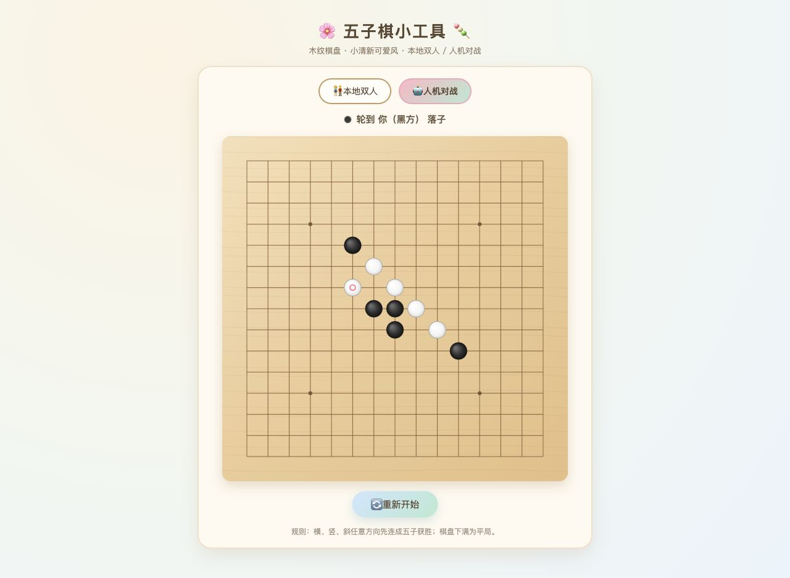
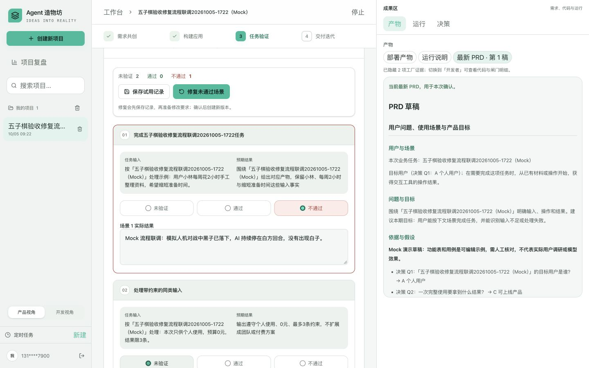
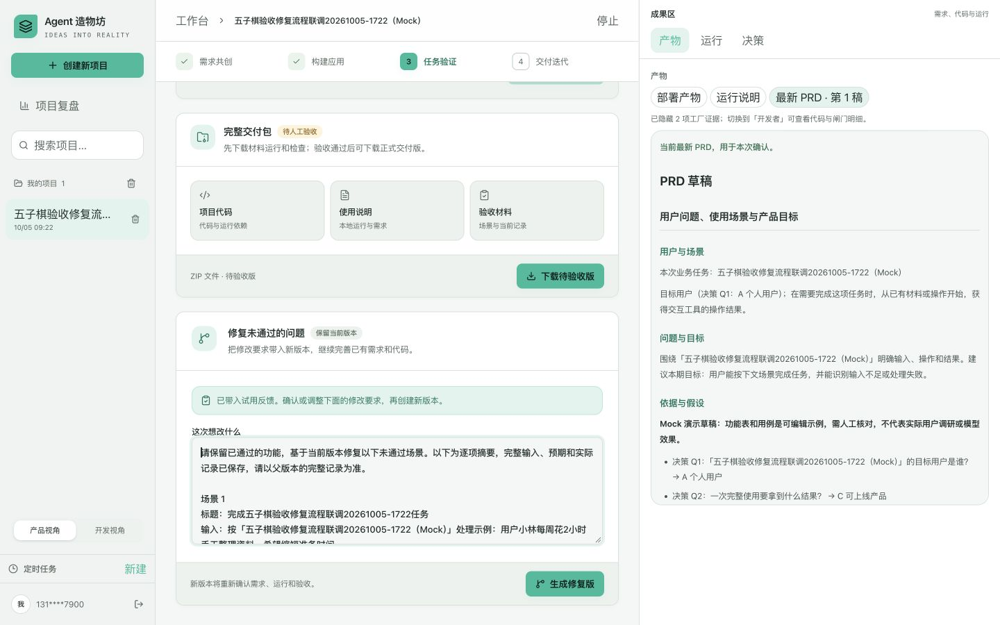
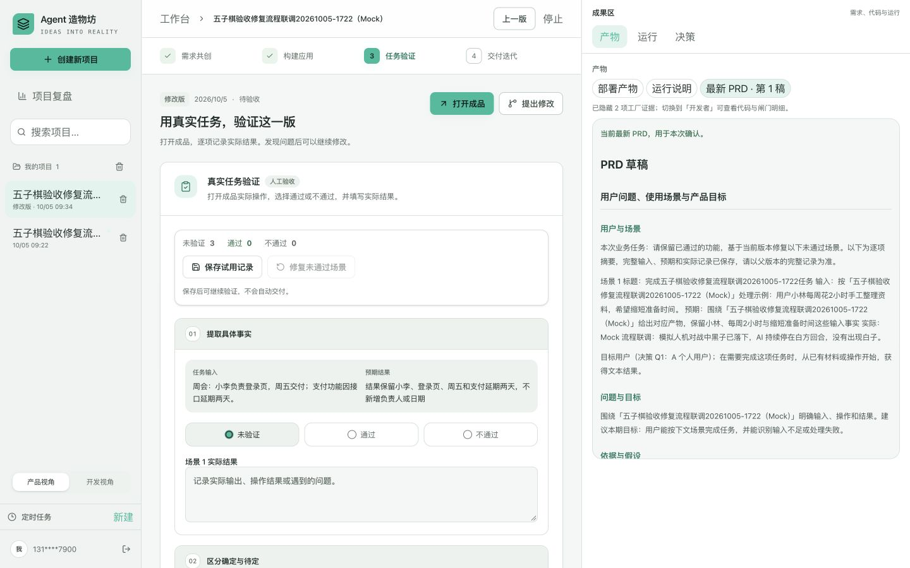
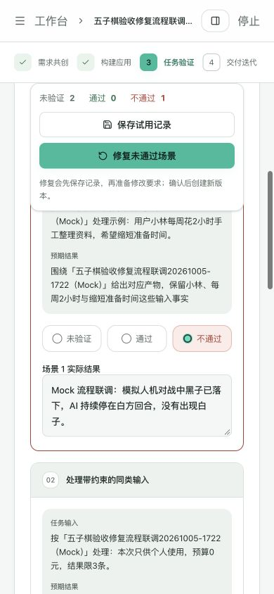

# 人工验收不通过与修复：验证记录

验证日期：2026-10-05。范围：用户报告的五子棋 AI 不落子问题，以及工厂人工验收发现失败后进入修复版本的操作闭环。

## 结论与边界

最新五子棋预览已修复 AI 自动落子：浏览器连续操作 5 个黑方回合，每次均出现白方回应，最后回到黑方回合。工厂支持按场景选择未验证、通过或不通过，保存实际结果，从未通过场景准备修复要求，再明确创建新版本。新版本需要重新确认需求、构建和验收。

本记录证明上述故障修复及工程流程；没有代替用户完成整份五子棋业务验收，没有把任何真实版本标记为正式交付。生成修复子版本的联调用本地 Mock，不产生真实模型调用，也不代表模型生成质量成绩。

## 五子棋故障与修复

用户成品的最新版本为 `8403cd0e-c0a9-42e5-b74c-c844cb7448a0`，预览地址为 `http://127.0.0.1:8003/`。修复前，人机对战中黑子落下后回合变为白方，但没有触发 AI 调度，后续人工输入也被白方回合保护拦住。

根因是 `handleClick` 调用 `placeStone` 后缺少 AI 调度。当前成品的 AI 使用本地棋盘启发式，不调用 DeepSeek；本故障不是模型服务故障。修复仅调整这一版 `app.py` 中的落子与计时器链路：成功且未终局的人类落子调度 AI；重复点击、占用格和 AI 思考期间不能重复调度；重开或切换模式清除旧计时器；AI 回调再次检查当前模式、回合及终局状态。

历史初版 `2be796b7-37df-476c-811c-057b19f56070` 的代码保持原样。重启的仅是最新版本预览，端口继续使用 8003。真实最新版本仍为 `awaiting_acceptance`，`accepted_at=null`。

| 验证 | 结果 |
| --- | --- |
| 原始事件链复现 | 修复前黑子 1、白子 0，白方回合没有待执行 AI 计时器 |
| 浏览器实际操作 | 连续 5 次黑方落子均得到白方回应，棋盘最终黑子 5、白子 5，提示轮到黑方 |
| JavaScript 事件链回归 | 11 场景通过，覆盖正常回应、思考期重复点击、占用格、多回合、重开、切换模式、本地双人、人类胜出、AI 胜出、平局和终局后重开 |
| Python 源文件编译 | 通过 |

## 工厂验收与修复流程

按场景保存时，未验证场景不会写成失败。已选择通过或不通过的场景必须填写实际结果。任何未验证或失败场景都不能进入正式交付。修改场景状态或实际结果后，最终三项交付确认需要重新勾选。

“修复未通过场景”先保存当前结果，再带入失败场景的标题、输入、预期和实际结果，定位修改区。“生成修复版”才创建子版本并进入执行。旧版失败记录和代码保留；完整父版上下文继续传入新版本。

没有场景清单的基础验收也支持填写不通过原因并保存、准备修复。后端 `POST /api/v1/runs/{id}/reject` 只记录拒绝原因和事件，不自动执行模型、不改变版本为已交付。重复提交同一最新问题记录不会重复创建事件；不同原因保留独立事件。拒绝原因进入后续子版本父版上下文。

### 浏览器联调结果

联调项目：`五子棋验收修复流程联调20261005-1722（Mock）`，父版 `9796fe3d-82dd-4a5c-a9cf-390f1f810418`，子版 `3a16d62d-07d6-47a7-a6a1-faa3a14f5d84`。这些是本次独立测试夹具，证据保存后清理。

| 操作或检查 | 实际结果 |
| --- | --- |
| 父版场景 1 选择不通过并填写模拟故障 | 保存后只持久化该场景，其他 2 场景保持未验证 |
| 刷新页面 | 失败选项与实际结果仍在，正式交付按钮禁用 |
| 修复未通过场景 | 修改区自动填写标题、输入、预期和实际结果，并提示确认后生成修复版 |
| 生成修复版 | 创建关联同一项目的 Mock 子版本，保留父版 |
| 子版父上下文 | 含 PRD、代码文件、完整场景、失败实际记录、验收原因及需求反馈；实际失败文字、输入和预期均存在 |
| 子版问答、确认需求、构建 | 正常回到 `awaiting_acceptance`，3 场景均未验证、`acceptance_results=[]`、`accepted_at=null` |
| 返回上一版 | 原版仍有 1 个不通过、2 个未验证，原始失败文字保持一致 |
| 桌面 1440 × 900 | 操作区只有一组保存/修复按钮；滚动到第 3 场景后操作条仍固定于工作区顶部（top=118） |
| 手机 390 × 844 | 页面及文档宽度均为 390，两按钮可见可操作，无页面横向溢出 |

## 工程检查

| 检查 | 结果 |
| --- | --- |
| 后端完整 pytest（隔离数据库、隔离数据目录、Mock） | 374 passed，71.30 秒，2 条第三方弃用警告 |
| 不通过接口及父上下文回归 | 20 个相关测试通过，已包含在后端完整测试中 |
| 前端测试 | 48 passed，4 个测试文件 |
| 生产构建与 TypeScript | 通过；修复验收操作条滚动容器后再次构建通过 |
| 新增组件、草稿 helper 和测试文件 ESLint | 通过；未声称历史页面全量 lint 清零 |

后端完整测试的临时子进程在完成断言后，后台扫描线程因临时数据库清理输出一次关闭期错误，进程最终以 0 退出。该信息仅来自隔离测试进程，不是运行中服务异常；测试断言全部通过。

## 状态保留与清理

测试夹具只清理上述 Mock 父子版本、同一临时项目的关联记录、代码和证据目录。用户真实五子棋两版、业务验收记录、预览服务及截图证据保留。临时验证脚本在结果保存后删除。工作台和最新五子棋预览继续可访问。
