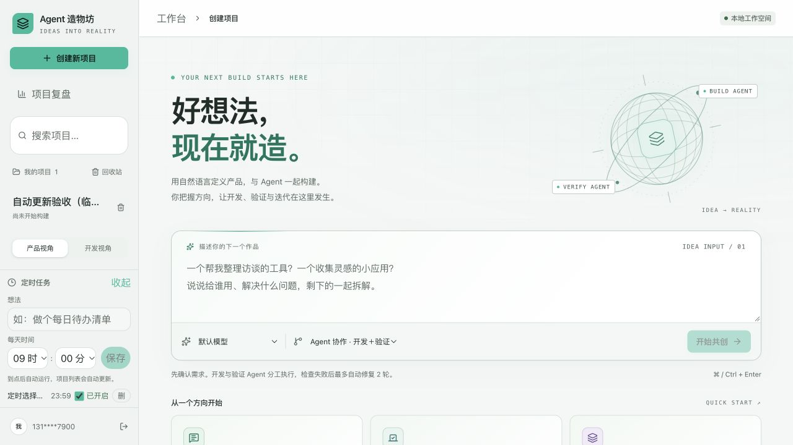
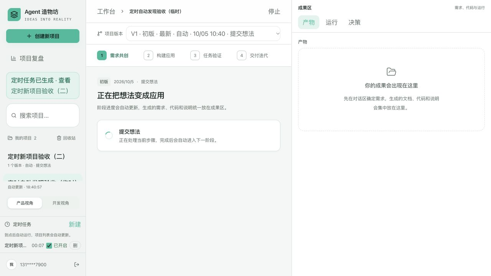

# 定时选择与自动更新

2026-10-05。修改 `frontend/app/page.tsx`。

每天时间改为小时（00–23）、分钟（00–59）两个原生选择器，支持选择列表和键盘上下操作。保存成功才清空表单；请求期间禁止重复提交，失败显示错误并保留输入。

项目、运行及定时列表在页面可见时每 5 秒同步；切回页面或窗口获焦立即同步。后台页面暂停周期请求，同步未完成时不叠加下一轮；保留请求序号检查，避免旧响应覆盖新状态。同步不切换当前项目或版本。

后台调度仍每 30 秒扫描一次，使用服务所在机器的本地时间；到点后正常约 35 秒内可在前台列表看到新运行（另加网络与服务处理耗时）。关闭浏览器不会停止后台调度，但后端服务必须持续运行。未改变同日去重与人工确认闸门。

验证结果：

- 前端 Vitest：5 文件、53 项通过；Next.js 生产构建及 TypeScript 通过。
- 后端既有定时调度、定时 API 专项：7 项通过；调度测试隔离模型启动。
- 浏览器独立测试账号：选择并保存 23:59，列表显示正确；保存后恢复默认 09:00。
- 页面不刷新、不导航时，后台新增的专用测试项目自动出现在项目列表；表单仍保持展开。
- 临时项目与未触发的定时任务已按账号、固定 ID／专用内容精确清理。没有调用付费模型，没有修改真实用户任务。

## 用户复测后的同步补强

用户反馈定时到点后左侧仍需手动刷新。日志确认 18:32:03 调度已生成新 Run，但没有保留当时浏览器的请求时序和渲染状态，无法据此确定这次未显示的具体原因。上一轮浏览器只新增普通项目，未覆盖定时生成、无 project_id 的 Run，不能作为完整定时链路验收结论。

已确认并修复同步机制中的缺口：原同步等待全部请求结束；任一请求一直挂起就会使后续轮询一直跳过。现在同步请求 12 秒超时取消并自动重试，忽略取消后的晚到结果；统计改为独立 30 秒同步，不阻塞 5 秒项目发现。列表读取禁用缓存；切回页面、重新联网时立即尝试同步。同步不再等待用户操作完成，仍用请求序号阻止删除后的旧响应覆盖。

左侧显示最后成功同步时间，失败显示“项目同步暂时中断，正在重试…”。发现新的定时 Run 后，在滚动列表之外显示“定时任务已生成 · 查看”，点击进入该运行；运行被移除后提示消失。不会自动切换正在查看的项目。

补充验证：

- 新增请求挂起超时恢复、晚到请求、隐藏/恢复、失败重试及退出取消测试。前端 6 文件、56 项通过；新同步模块 lint、最终生产构建及 TypeScript 通过。
- 使用独立 QA 账号，执行真实 `check_due_schedules()`，查询范围限定为专用 Schedule；仅在该测试进程固定时间为 00:07，并替换模型启动入口为空操作，不触发真实模型或其他人的任务。
- 第一次停留在工作台，不刷新、不导航，新 Run（无 project_id，与用户实际调度结果一致）自动显示在项目列表及新增提示中。
- 点击提示打开首个 Run，保持 SSE 进度连接，再执行该专用 Schedule 的第二次受控触发。第二个 Run 和提示自动显示，当前仍查看第一个 Run。
- 临时 Schedule 与两个 Run 均按固定 ID、专用内容和 QA 账号清理。没有修改真实用户的定时、运行和模型设置。

