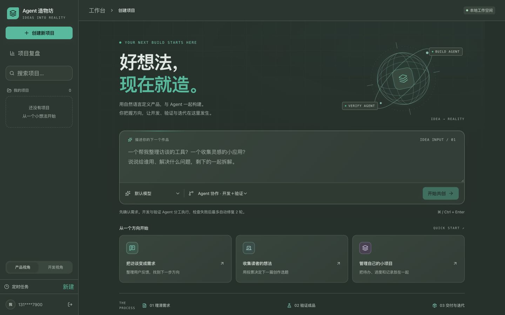

# 柔和配色与预算边界验证

2026-10-05。说明见 [技术记录](../../技术文档/柔和配色与调用上限修复.md)。

- 后端全套 283 passed（1 项既有第三方弃用警告），覆盖调用上限收束、源码变更拒绝恢复、失败预算不重置、PRD 确认和并发恢复，以及重跑保留执行模式。
- 前端 39 项现有测试、类型检查和生产构建通过；关键文本静态对比度最低 4.53，桌面首页实际显示已核对。
- 原真实任务 `e09f1f77-4023-4558-be1c-b4aa93d8f43f` 保留需求与代码，从严格校验的预算边界检查点继续。实际调用次数为开发 6 次、验证 2 次；最新开发与独立验证检查通过，当前状态待用户验收，错误已清空。
- 单元测试使用 Mock。原任务恢复使用原配置 DeepSeek，最终人工业务验收没有自动执行；示例视频数据不算真实抖音数据接入。
- 本轮完整测试新增的 102 个生成目录已清理，清理前排除了生产数据库中所有 Run ID。

