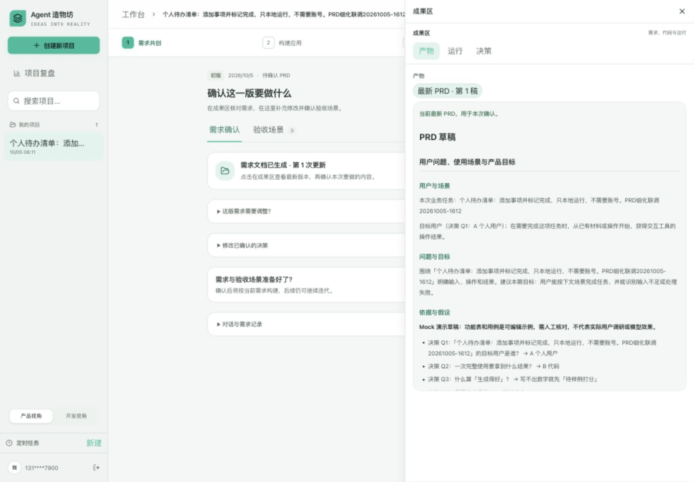
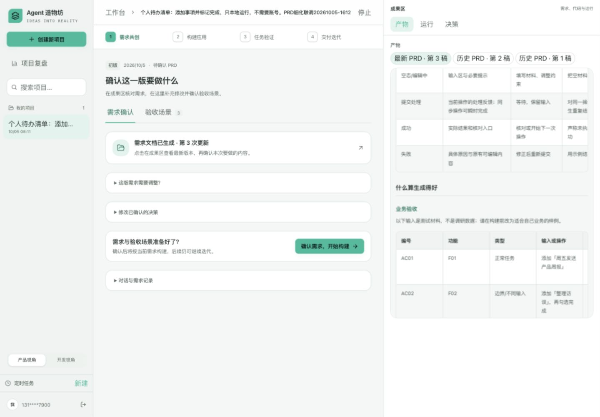
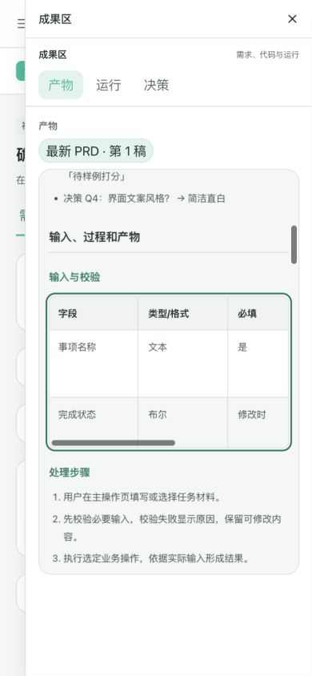

# 生成 PRD 细化验证记录

日期：2026-10-05。对应 [技术说明](../../技术文档/生成PRD细化.md)。本轮完善工厂生成给用户的产品 PRD，版本仍为 V1.2。

## 验证结论

| 项目 | 结果与边界 |
| --- | --- |
| 后端完整套件 | 最终 `335 passed, 2 warnings in 43.82s`；临时 SQLite、服务与测试辅助方法的 DATA_ROOT 全部隔离 |
| 新增回归 | 决策解析 33 项、PRD 完整性 19 项；RealLLM 的 `_chat` 使用纯替身，验证 8000 token 请求、至多 3 次尝试与结构缺口修复 |
| 前端 | `npm test` 39 项通过；`npm run build` 通过，包含 TypeScript 检查；未声明整体 ESLint 无错误 |
| 内容结构 | 页面字段、功能编号、状态操作限制、业务验收表与全部必需小节保留；长但粗糙的背景文字、空对象、全占位及功能/验收缺口不能通过门禁 |
| 协议与历史 | 9 个顶层键不变；旧 PRD JSON/Markdown 继续兼容；新的 Markdown 子章节、表格、F/AC 编号在规范化和导出格式化后保留 |
| 桌面 | 1440×1000：完整 PRD 只在右侧成果区出现，中栏无全文和表格；右侧 5 张表均在独立容器内 |
| 手机 | 390×844：页面 scrollWidth 为 390，表容器宽 298、内容宽 544–784；键盘 ArrowRight 后容器 scrollLeft 为 40，整页宽度不变 |
| 决策与更新 | 点击 A 个人用户、B 代码、Q3 按推荐；右侧记录完整选项与实际推荐。补充规则后第 3 次更新仍保留事项名称/完成状态及最新要求；第 2 次更新经过刷新保留 |
| 模型及业务效果 | 本轮真实模型调用 0；只验证结构、数据传递和离线显示，不代表真实生成语义正确，也未进行人工业务验收 |

生产构建提示工作区外的 package-lock 未使用；两条后端警告为第三方弃用提示，均未造成检查失败。

## 页面联调

使用本地 Mock 创建唯一联调想法：`个人待办清单：添加事项并标记完成，只本地运行，不需要账号。PRD细化联调20261005-1612`。

- run：`dc50cefa-c290-4178-b5d0-a112945a84a0`；project：`612158c9-83bf-4778-9178-4411c104b808`。
- 初始 PRD 及两次补充均停在 `awaiting_prd_confirm`；没有启动真实模型或把联调用例确认成业务验收通过。
- 普通补充要求曾使 Mock 字段选择退回通用材料；已统一字段与用例的业务范围，并增加保留事项字段的回归检查。严格生成门禁本身只检结构。
- Markdown 表格支持键盘聚焦与独立横向滚动；手机视口恢复默认，浏览器回到工作台。

截图显示 Mock 草稿，不能当作真实模型生成质量证据：

## 清理

按精确 idea、run/project、Mock、未验收、项目仅含本次 run 等条件校验后，删除上述 QA run/project 及 15 条阶段事件、4 条决策、3 条证据、1 条指标；对应证据目录已删除，QA run 剩余 0。

第一轮隔离运行中，两个旧测试辅助方法仍将 7 个随机 UUID 的代码夹写到原 data/code。已按时间窗、固定测试源码、仅 app.py/requirements.txt 文件集合及生产库无对应 run 的条件核对后清理；最终复验隔离了这些辅助路径。临时清理脚本已删除，其余用户项目和运行未修改。

## 复现

后端通过 `.venv/bin/python` 提前将 `DATABASE_URL` 指向 TemporaryDirectory，再导入 config/models；设置 `LLM_PROVIDER=mock`、空 `LLM_API_KEY`，统一 engine/evidence/testing/deploy/delivery/runner 的 DATA_ROOT、runner.PREVIEW_DIR 与测试模块 DATA_ROOT 后运行 `pytest.main(['tests','-q','--disable-warnings','--tb=short'])`。临时目录由 TemporaryDirectory 收尾删除。

前端在 `frontend/` 执行 `npm test` 与 `npm run build`。本地预览仍使用 3010 前端、8010 后端。
