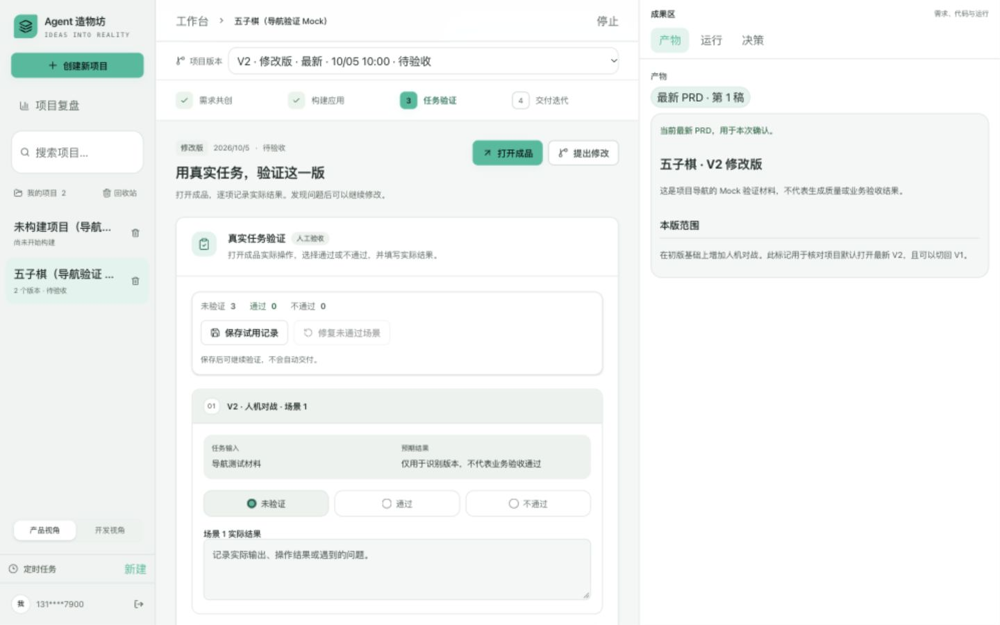
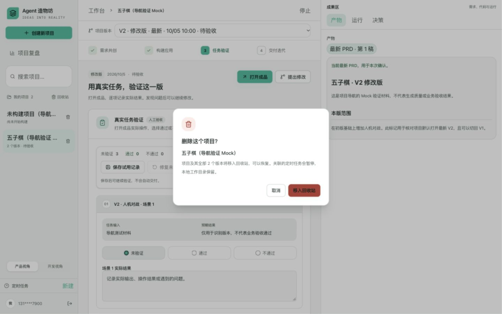
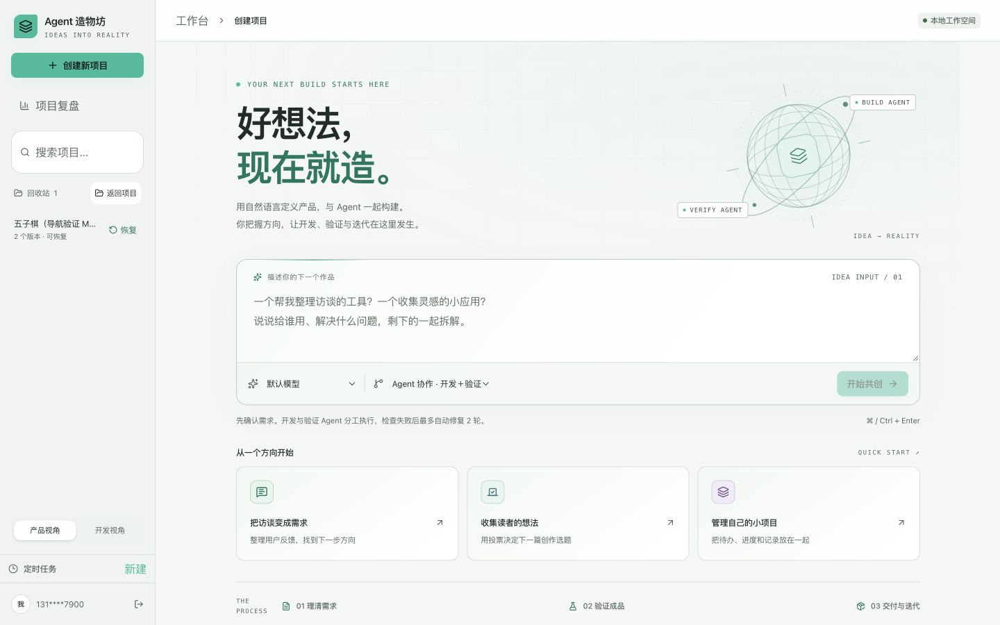
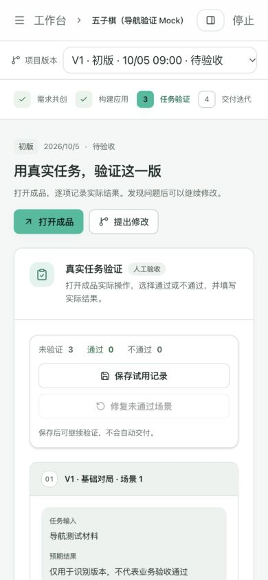
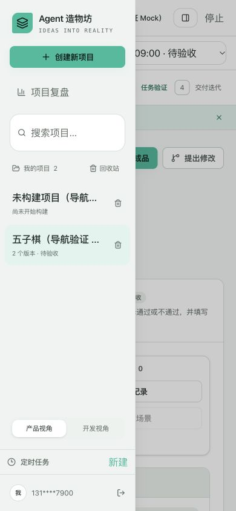

# 项目列表与版本导航验证

日期：2026-10-05。范围：项目与版本的导航区分、回收站入口、每项目唯一删除入口。前端地址：`http://127.0.0.1:3010/`。

## 浏览器结果

使用独立 Mock 导航夹具：一个五子棋项目含 V1/V2 两版，各自有可区分的需求与场景；另一个项目尚未构建。夹具只验证界面和已保存状态，不执行生成模型，不代表五子棋业务验收通过。

| 验证项 | 结果 |
| --- | --- |
| 项目分组 | 两个项目展示两行和两个删除入口；五子棋两版只显示一行及「2 个版本」 |
| 默认打开 | 点击五子棋项目进入最新 V2，同时展示 V2 需求与场景 |
| 旧版切换 | 选择 V1 后需求与三条场景切回 V1；项目保持选中 |
| 刷新恢复 | 刷新后版本选择仍为 V1、需求仍为 V1 |
| 从项目重新进入 | 再点击左侧项目回到最新 V2 |
| 删除取消 | 对话框明确全部 2 个版本；取消后两个版本均在 |
| 删除与回收站 | 确认后整个项目退出活动列表，回收站显示「2 个版本 · 可恢复」 |
| 回收站刷新与恢复 | 刷新后仍能找到删除项目，恢复后项目重新只有一行，版本选择器恢复 2 个选项 |
| 空项目 | 保留一行「尚未开始构建」及唯一项目删除入口 |
| 桌面 1440×900 | 项目列表、文字回收站、版本选择器和成果区可见 |
| 手机 390×844 | 切换 V1 成功；抽屉显示唯一项目入口；body/document 宽度均为 390，选择器右边界 374，无页面横向溢出 |
| 手机标题 | 操作按钮可换到下一行，标题宽 350、高 32，不再被挤为窄列 |

## 工程检查与阶段闸门

| 检查项 | 结论 |
| --- | --- |
| 本轮功能实现 | 是；项目分组、版本导航、文字回收站与恢复入口 |
| 自动化测试 | 是；前端 53/53，含新增 5 项归属与版本分组回归 |
| 真实模型冒烟 | N/A；导航变更，不调用模型 |
| 类型、构建与 lint | 是；最终 TypeScript 和生产构建通过；新增组件/helper/测试 ESLint 通过。历史 page.tsx 全量 lint 未声称清零 |
| 后端与数据库迁移 | N/A；本轮没有后端实现变更，浏览器复用真实删除/恢复 API |
| 配置和凭证 | 是；无凭证或模型配置改动 |
| 状态恢复 | 是；重启前端后选择版本保持，刷新回收站后仍能恢复；未重启后端 |
| 桌面与手机 | 是；1440×900、390×844 实测 |
| README、PRD、项目状态 | 是；同步本轮入口与语义 |
| 证据 | 是；本记录与 5 张截图 |

Mock 夹具项目 ID 为 `9c78c716-ea33-4f86-b67c-1e4dc9b76f65`、`1bb72df0-2ba4-4d66-9d20-6c390e0b1b27`，版本 ID 为 `46c99dd6-132d-4426-9c7d-bc502a0bde89`、`07b809b4-4c2a-4ca0-8f1e-3f33cb2d81ba`。截图保存后只清理这些临时项目、版本及其证据文件和脚本；真实用户项目与全部历史版本保留。
