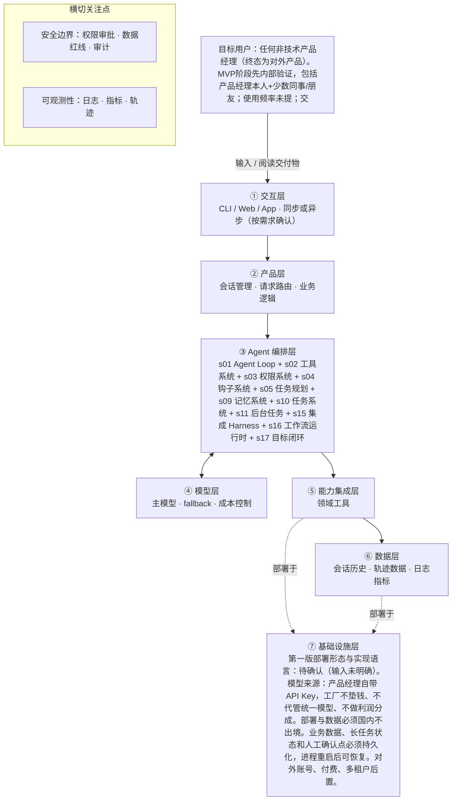

# PRD 推导方案 ——「Agent造物坊」

> 状态：方案待确认（Step 1–4 已完成，Step 5 代码生成需确认后启动）
> 推导引擎：Agent Blueprint · 模型：anthropic (DeepSeek deepseek-v4-pro)

## 产品定位（一句话）

**Agent造物坊**：给非技术产品经理用，通过可复用的AI约束流程（阶段、闸门、证据包）把想法稳定做成可上线的AI/Agent产品。

## ⚠️ 待确认清单（答不上就是风险点）

1. 要达成什么？请给出可量化成功标准：跑通第一款后，样例打分的通过分、可接受瑕疵、时间口径（如‘一天一款’）和单款成本上限分别是什么？
2. 给谁用？目标用户已明确为非技术产品经理，但请补充MVP内部试用的人数、使用频率，以及人机交互是同步实时还是异步等待确认？
3. 一次完整交付长什么样？请明确部署目标环境、账号隔离的具体实现边界，以及PRD/技术文档/验收证据包的具体内容清单是否已固定？
4. 需要什么外部动作？必须调用的云服务、部署平台、代码仓库、支付/短信/实名认证等外部API分别有哪些？
5. 领域知识在哪？模型必须知道的可复用AI约束流程、阶段闸门规则、blueprint六可标准等文档/schema存放在哪里、由谁维护？
6. 什么绝对不能做？除已列红线外，高风险/不可逆/涉及费用/对外动作的具体清单是否已有明确范围？
7. 失败怎么办？工具失败、模型幻觉、超时、越权时的降级策略、重试机制和人工兜底流程是什么？
8. 怎么算成功？可度量指标（完成率、时延、成本、准确率、稳定出货率）的具体目标值是多少？
9. 7层架构图的层定义未在输入中给出，无法将工具归属到①-⑦，需补充层定义。
10. 人工交互渠道具体是 UI 还是消息待确认。
11. 第一版部署形态（单进程/服务/团队）与实现语言需确认。
12. 上下文压缩、子 Agent、技能加载、定时调度、Agent 团队、MCP 插件是否纳入第一版仍为待确认。
13. 单款成本上限、“一天一款”时间口径、时延与并发指标需实测后确定。
14. 【组件 s06 子 Agent】是否会出现上下文爆炸的子任务，或可并行的探索型子任务？
15. 【组件 s07 技能加载】领域知识库是否庞大、需要按需加载？
16. 【组件 s08 上下文压缩】会话是否很长、工具输出或日志量是否很大？
17. 【组件 s12 定时调度】是否需要定时自动触发？
18. 【组件 s13 Agent 团队】是否需要多任务并行且各自隔离工作区（多 Agent 团队）？
19. 【组件 s14 MCP 插件】是否需要接入外部工具生态（MCP、第三方插件）？

## Step 1 · 需求拆解（提取硬事实）

| 维度 | 结论 | 状态 | 出处 |
|---|---|---|---|
| 目标 | 构建一个可复用的AI约束流程工厂，稳定地把产品经理的想法做成可上线的AI/Agent产品；总标准是“稳定出货——想法能走到可上线产品，全程通过闸门，不靠删测试、降标准、mock冒充通过”；量化数字标准、单款成本上限与“一天一款”时间口径待跑通第一款后实测再定。 | 待确认 | “核心任务：产品经理给一个想法，工厂用一套可复用的AI约束流程（阶段、闸门、证据包），稳定地把想法做成可上线的AI/Agent产品。”；“总标准：稳定出货...数字标准：待样例打分...时间口径...先实测第一款要多久再定。” |
| 用户 | 目标用户：任何非技术产品经理（终态为对外产品）。MVP阶段先内部验证，包括产品经理本人+少数同事/朋友；使用频率未提；交互同步/异步未明确，但过程中产品经理需查看进度、回答问题、查看证据、打分。 | 待确认 | “目标用户：任何非技术产品经理（终态为对外产品）。MVP阶段先内部（产品经理本人+少数同事/朋友）验证跑通，再开放对外。”；“产品经理在过程中看到进度、回答问题、查看证据。” |
| 核心闭环 | 输入：产品经理的想法/点子（一句话或PRD草稿）+业务判断（回答必须问的问题）+自带API Key。Agent行为：按固定工序推进（拆需求→定架构→写代码→测试→上线），每阶段执行后经闸门检查并交付证据包，由产品经理确认。交付物：完整可上线产品（前后端代码+部署+账号隔离）及PRD、技术文档、验收证据包。 | 明确 | “输入：产品经理的想法/点子...过程：AI按固定工序推进...产物：完整可上线产品...及配套的PRD、技术文档、验收证据包。” |
| 交付物 | 完整可上线产品（前后端代码+部署+账号隔离），以及配套的PRD、技术文档、验收证据包；长期保留PRD、项目状态、决策台账、证据包。 | 明确 | “产物：完整可上线产品（前后端代码+部署+账号隔离），以及配套的PRD、技术文档、验收证据包。”；“长期保留：每个产品的PRD、项目状态、决策台账、证据包。” |
| 边界 | 模型不自主决定高风险/不可逆/涉及费用/对外的动作（由确定性代码+人工确认约束）；密钥不进仓库、不进前端、不在对话/日志/截图/提交记录中回显；数据与部署国内不出境；MVP先内部，第一步只跑通“想法→固定流程AI应用完整上线”，自主Agent与对外账号/付费/多租户后置。 | 明确 | “安全红线：高风险/不可逆/涉及费用/对外的动作，由确定性代码+人工确认约束，不交给模型自主决定。”；“密钥纪律：密钥不进仓库、不进前端、不在对话/日志/截图/提交记录中回显。”；“部署与数据：全部数据与部署在国内、不出境。”；“第一步（MVP）：只跑通‘想法→固定流程AI应用完整上线’一条线。” |
| 约束 | 模型来源：产品经理自带API Key，工厂不垫钱、不代管统一模型、不做利润分成；数据与部署国内不出境；多租户隔离（对外时强制，权限判断在后端）；业务数据、长任务状态、人工确认点必须持久化，进程重启后可恢复；登录为手机号验证码；企业实名认证耗时数天；云费用预算与单款成本上限待定；时延、并发未提。 | 待确认 | “模型来源：产品经理自带API Key...成本上限：待定”；“部署与数据：全部数据与部署在国内、不出境。”；“多租户隔离...持久化...” |

## Step 2 · 领域建模（映射 Harness 五要素）

| 要素 | 内容 |
|---|---|
| **工具** | 调用产品经理自带 API Key 的模型接口执行阶段任务（拆需求、定架构、写代码、测试、上线）。；将 PRD、项目状态、决策台账、证据包等长期保留数据写入持久化存储。；将业务数据、长任务状态、人工确认点写入持久化存储，使进程重启后可恢复。；调用国内部署与数据存储接口完成部署与账号隔离，交付完整可上线产品。；调用手机号验证码登录接口执行用户身份验证。 |
| **知识** | 产品经理输入的想法或 PRD 草稿及业务判断回答作为需求与业务规则来源。；固定工序（拆需求→定架构→写代码→测试→上线）作为阶段执行顺序的流程知识。；闸门检查标准和证据包要求作为每阶段验收规则。；安全红线和密钥纪律（密钥不进仓库、前端、对话、日志、截图、提交记录）作为权限与数据处理规则。；全部数据与部署国内不出境的规则作为部署与存储约束。；长期保留的 PRD、项目状态、决策台账、证据包作为可追溯的项目知识资产。 |
| **观察** | 通过每阶段闸门检查并交付证据包，确认阶段产出符合验收标准。；产品经理查看进度、回答问题、查看证据并打分，作为人工确认与质量反馈。；通过持久化的项目状态和决策台账追踪阶段执行、决策变更和恢复状态。；通过持久化的人工确认点确认高风险、不可逆、涉及费用或对外动作是否已获批准。；审计对话、日志、截图、提交记录，确认密钥未回显、未进入仓库或前端。；检查部署与数据存储位置，确认全部数据与部署在国内且不出境。 |
| **行动** | 通过模型接口 API 调用执行拆需求、定架构、写代码等生成动作。；通过固定工序执行流程按阶段推进，并执行测试与上线动作。；通过人工交互接口（具体为 UI 或消息待确认）向产品经理展示进度并接收回答与打分。；通过手机号验证码登录接口完成身份认证。；通过部署系统与账号系统执行部署和账号隔离。；通过后端权限判断执行多租户隔离（对外时强制）。 |
| **权限** | 默认拒绝：模型不得自主决定高风险、不可逆、涉及费用或对外的动作，必须经人工确认或确定性代码批准后执行。；默认拒绝：密钥不得写入仓库、前端、对话、日志、截图或提交记录，禁止回显。；全部数据与部署仅限国内，禁止出境。；对外账号、付费、多租户等对外能力在 MVP 阶段后置，不得由模型直接开放。；多租户隔离由后端权限判断强制执行，禁止跨租户访问数据。；模型调用费用使用产品经理自带 API Key 承担，工厂不垫钱、不代管统一模型、不做利润分成。 |

## Step 3 · 组件选型（宁可少选）

| 组件 | 选否 | 理由 | 参考 |
|---|---|---|---|
| s01 Agent Loop | ✅ 必选 | 一切基础：循环 + 工具（一切基础，恒选） | s01_agent_loop/README.md |
| s02 工具系统 | ✅ 必选 | 需要调用外部系统/API/数据源（一切基础，恒选） | s02_tool_use/README.md |
| s03 权限系统 | ✅ 必选 | 安全红线明确要求高风险/不可逆/涉及费用/对外的动作由确定性代码+人工确认约束，不交给模型自主决定。 | s03_permission/README.md |
| s04 钩子系统 | ✅ 必选 | 要求交付证据包、长期保留PRD/项目状态/决策台账/证据包用于追溯，且每阶段闸门检查。 | s04_hooks/README.md |
| s05 任务规划 | ✅ 必选 | 主链路为阶段0到阶段5的多阶段分步流程，每阶段需执行、闸门检查、交付证据包和人工确认。 | s05_todo_write/README.md |
| s06 子 Agent | ❓ 待确认 | 输入未说明：是否会出现上下文爆炸的子任务，或可并行的探索型子任务？ | s06_subagent/README.md |
| s07 技能加载 | ❓ 待确认 | 输入未说明：领域知识库是否庞大、需要按需加载？ | s07_skill_loading/README.md |
| s08 上下文压缩 | ❓ 待确认 | 输入未说明：会话是否很长、工具输出或日志量是否很大？ | s08_context_compact/README.md |
| s09 记忆系统 | ✅ 必选 | 要求长期保留每个产品的PRD、项目状态、决策台账和证据包，用于追溯和复用。 | s09_memory/README.md |
| s10 任务系统 | ✅ 必选 | 要求业务数据、长任务状态、人工确认点必须持久化，进程重启后可恢复。 | s10_task_system/README.md |
| s11 后台任务 | ✅ 必选 | 企业实名认证耗时数天，并明确阶段0起并行去办。 | s11_background_tasks/README.md |
| s12 定时调度 | ❓ 待确认 | 输入未说明：是否需要定时自动触发？ | s12_cron_scheduler/README.md |
| s13 Agent 团队 | ❓ 待确认 | 输入未说明：是否需要多任务并行且各自隔离工作区（多 Agent 团队）？ | s13_agent_teams/README.md |
| s14 MCP 插件 | ❓ 待确认 | 输入未说明：是否需要接入外部工具生态（MCP、第三方插件）？ | s14_mcp_plugin/README.md |
| s15 集成 Harness | ✅ 必选 | 第一版已选 8 个可选组件（s03, s04, s05, s09, s10, s11, s16, s17），需归一到单一循环 | s15_integrated_harness/README.md |
| s16 工作流运行时 | ✅ 必选 | AI按固定工序推进，步骤为拆需求→定架构→写代码→测试→上线，且MVP明确为固定流程AI应用。 | s16_workflow_runtime/README.md |
| s17 目标闭环 | ✅ 必选 | 每阶段有闸门检查（十项是否表）和证据包，并要求不靠删测试、降标准、mock冒充通过。 | s17_goal_loop/README.md |

特征判定依据：

- `destructive_ops` = yes：安全红线明确要求高风险/不可逆/涉及费用/对外的动作由确定性代码+人工确认约束，不交给模型自主决定。
- `audit_needed` = yes：要求交付证据包、长期保留PRD/项目状态/决策台账/证据包用于追溯，且每阶段闸门检查。
- `multi_step` = yes：主链路为阶段0到阶段5的多阶段分步流程，每阶段需执行、闸门检查、交付证据包和人工确认。
- `context_heavy` = unknown：原文未明确提及上下文爆炸或并行探索型子任务，仅提到自主Agent产品后置。
- `large_knowledge` = unknown：原文未提及领域知识库规模或是否需按需加载。
- `long_sessions` = unknown：原文只要求长任务状态持久化和进程重启可恢复，未明确会话长度、工具输出或日志量。
- `cross_session_memory` = yes：要求长期保留每个产品的PRD、项目状态、决策台账和证据包，用于追溯和复用。
- `persistent_goals` = yes：要求业务数据、长任务状态、人工确认点必须持久化，进程重启后可恢复。
- `slow_operations` = yes：企业实名认证耗时数天，并明确阶段0起并行去办。
- `scheduled` = unknown：原文未提及定时自动触发，无法判断是否需要。
- `parallel_isolated` = unknown：原文有多租户隔离要求，但未明确多任务并行、多Agent团队或各自隔离工作区。
- `external_ecosystem` = unknown：原文未提及MCP、第三方插件或外部工具生态接入。
- `fixed_orchestration` = yes：AI按固定工序推进，步骤为拆需求→定架构→写代码→测试→上线，且MVP明确为固定流程AI应用。
- `auto_completion` = yes：每阶段有闸门检查（十项是否表）和证据包，并要求不靠删测试、降标准、mock冒充通过。

## Step 4 · 架构设计

### 分层架构图（7 层 + 数据流）



| 层 | 名称 | 回答的问题 | 落地锚点 |
|---|---|---|---|
| ① | 交互层 | 谁在用、怎么用？ | CLI / Web / App / API；同步或异步；人机比 |
| ② | 产品层 | 产品外壳是什么？ | 会话管理、请求路由、账户、业务逻辑 |
| ③ | Agent 编排层 | Harness 如何运转？ | loop、工具分发、hooks、权限、记忆、任务、技能、压缩、子 agent / 团队、目标闭环 |
| ④ | 模型层 | 智能从哪来？ | 主模型、辅助模型、路由、fallback、成本 |
| ⑤ | 能力集成层 | 如何触达外部世界？ | 内部工具、MCP server、知识库、第三方 API |
| ⑥ | 数据层 | 什么需要持久化？ | 记忆、任务、会话历史、轨迹数据、日志指标 |
| ⑦ | 基础设施层 | 如何部署运行？ | 单进程 / 服务 / 团队、沙箱、队列、调度、监控 |

### 工具清单

| 工具 | 输入 | 输出 | 副作用 | 权限 | 归属层 |
|---|---|---|---|---|---|
| `call_model_api` | 阶段任务生成请求、模型参数、产品经理自带 API Key 的安全引用 | 模型生成结果（拆需求、定架构、代码、测试结果等） | 调用外部模型接口，产生按量费用 | allow | 待确认 |
| `persist_project_artifact` | 制品类型（PRD、项目状态、决策台账、证据包）、内容、版本 | 持久化记录 ID | 写入长期保留的项目存储 | allow | 待确认 |
| `persist_runtime_state` | 任务 ID、长任务状态、人工确认点状态、业务数据 | 持久化保存确认 | 写入可恢复的运行时状态存储 | allow | 待确认 |
| `deploy_and_isolate_account` | 部署包/配置、国内目标环境、租户/账号隔离信息 | 部署状态、访问地址、隔离校验结果 | 执行上线部署与账号隔离，属于对外动作 | ask | 待确认 |
| `request_human_confirmation` | 展示内容（进度、问题、证据包引用）、所需回复/评分类型 | 产品经理回复、评分或确认 | 产生通知并阻塞等待人工输入 | ask | 待确认 |
| `verify_phone_login` | 手机号、验证码 | 身份验证结果 | 调用短信验证码验证服务，产生身份认证状态 | allow | 待确认 |
| `check_tenant_isolation` | 租户 ID、请求资源 ID、用户身份 | 是否允许访问 | 无业务副作用，仅执行后端权限判断 | deny | 待确认 |

### 系统提示词草案

```
你是 Agent造物坊 的固定流程执行 Agent。身份：非技术产品经理的 AI 产品制造执行器，不自行决定高风险动作。规则：严格按阶段推进（拆需求→定架构→写代码→测试→上线）；每阶段必须通过闸门并产出证据包，不靠删测试、降标准、mock冒充通过；高风险、不可逆、涉及费用或对外的动作必须由确定性代码和人工确认；密钥不进仓库、前端、对话、日志、截图或提交记录；数据与部署国内不出境。工具：call_model_api 调用用户自带 Key 模型；persist_project_artifact、persist_runtime_state 保存项目与运行状态；deploy_and_isolate_account 执行部署前需人工确认；request_human_confirmation 获取人工确认与评分；verify_phone_login 完成身份验证；check_tenant_isolation 由后端强制执行。知识目录：用户想法/PRD草稿、固定工序、闸门标准与证据包要求、安全红线与密钥纪律、国内部署约束、长期保留的项目资产。
```

### 上下文与记忆策略

会话内按阶段隔离上下文，仅载入当前阶段必要的输入、产物和闸门标准，上一阶段完整产物外置到持久化存储并通过引用访问；不在上下文中保留密钥、验证码或敏感凭据。跨会话持久化：PRD、项目状态、决策台账、证据包、业务数据、长任务状态、人工确认点必须持久化，进程重启后可恢复。是否引入上下文压缩或摘要策略，需待上下文压缩组件确认后确定。

### 安全边界与降级策略

- call_model_api 请求超时或失败 → 进入重试或暂停，保留失败上下文并写入决策台账，不得跳过阶段闸门，人工确认后继续。
- 模型幻觉生成虚构事实或未达到闸门标准 → 闸门检查对照输入与证据包拦截，拒绝通过并记录，不降低标准，要求重新生成。
- 长任务或部署超时 → 任务系统持久化当前状态，恢复后从检查点继续；部署超时需人工确认继续或回滚。
- 模型越权尝试调用高风险、对外或涉及费用动作 → 权限系统默认拒绝，deploy_and_isolate_account 必须 ask，check_tenant_isolation 为 deny，记录越权审计并通知产品经理。
- 密钥泄漏或回显风险 → 持久化、日志与轨迹记录过滤并禁止密钥字段，审计日志检查；发现即阻断并脱敏。
- 跨租户访问尝试 → check_tenant_isolation 后端强制执行，返回 deny，记录告警，阻止跨租户数据访问。

### 可观测性

- 日志：记录每次阶段推进的输入、闸门结果、证据包引用和人工确认结果。；记录每次工具调用的名称、参数元数据、耗时和结果状态，不记录密钥、验证码明文。；记录部署与账号隔离的国内目标环境、确认状态和结果。；记录越权拒绝与敏感动作拦截审计日志。
- 指标：阶段首次通过率与最终通过率。；每阶段耗时与项目总耗时。；工具调用失败率与重试次数。；人工确认等待时长与确认次数。；单款模型费用统计。
- 轨迹：轨迹按项目与阶段记录每一步输入、工具调用、产物、闸门判定和人工确认，写入决策台账/证据包持久化存储，不记录密钥、验证码明文。

### 技术栈与部署形态

- 实现语言与框架：后端 Python 3.12 + FastAPI + SQLAlchemy + SQLite；前端 Next.js（React + TypeScript + Tailwind）；桌面壳 Electron。
- 部署形态：本地 MVP 为「后端单进程（uvicorn :8010）+ 前端单进程（Next.js :3010）+ SQLite 文件」；`npm run desktop` 用 Electron 拉起前后端并打开桌面窗口。
- 配置与密钥外置：`.env`（LLM_PROVIDER / LLM_API_KEY / API_KEY / SMS_MOCK 等），密钥不进仓库、不进前端、不进日志。
- 模型来源：产品经理自带 API Key，工厂不垫钱、不代管统一模型、不做利润分成。
- 部署与数据必须国内不出境。业务数据、长任务状态和人工确认点持久化到 SQLite，进程重启后可恢复。
- 对外账号、付费、多租户：账号已做（手机号验证码 + user_id 隔离）；付费与公网部署后置（产品经理决定先不上线）。

## 验收标准对照（可落地 vs demo）

| 标准 | 要求 | 本方案的对应设计 |
|---|---|---|
| 可运行 | 一条命令能起，配置与密钥外置（.env / config） | 后端 `uvicorn app.main:app --port 8010` + 前端 `npm run dev -- --port 3010`（或 `npm run desktop` 一键拉起）。配置 `.env`（LLM_PROVIDER/LLM_API_KEY 等），密钥外置不进仓库/前端/日志。 |
| 可容错 | 工具失败、模型幻觉、超时、越权都有明确降级路径 | call_model_api 请求超时或失败 → 进入重试或暂停，保留失败上下文并写入决策台账，不得跳过阶段闸门，人工确认后继续。；模型幻觉生成虚构事实或未达到闸门标准 → 闸门检查对照输入与证据包拦截，拒绝通过并记录，不降低标准，要求重新生成。；长任务或部署超时 → 任务系统持久化当前状态，恢复后从检查点继续；部署超时需人工确认继续或回滚。 |
| 可观测 | 有日志、有指标、有轨迹数据 | 记录每次阶段推进的输入、闸门结果、证据包引用和人工确认结果。；记录每次工具调用的名称、参数元数据、耗时和结果状态，不记录密钥、验证码明文。；阶段首次通过率与最终通过率。；每阶段耗时与项目总耗时。 |
| 可测试 | 核心循环与工具分派有单测，权限与安全有边界测试 | 后端 pytest 77：状态机/闸门/失败与重试/看门狗/度量/鉴权 + 多用户隔离（test_auth）；前端 vitest（对话流重建）+ Playwright E2E（登录→完整闭环）。 |
| 可部署 | 有明确的部署形态（单进程 / 服务 / 团队）与启动文档 | 本地 MVP：后端单进程 + 前端单进程 + SQLite；README 有启动与验证文档；Electron 桌面壳。公网部署后置（产品经理决定先不上线，企业实名认证未办）。 |
| 可度量 | 有对齐 PRD 的成功指标，并能采集 | 阶段首次通过率与最终通过率。；每阶段耗时与项目总耗时。；工具调用失败率与重试次数。；人工确认等待时长与确认次数。；单款模型费用统计。 |

## 独立审稿意见

- 结论：✅ 通过（52 / 100），设计稿共 1 版
- 总评：方案在无编造、可容错、可观测与安全降级方面大体合规，但六条验收标准中可运行、可测试、可部署三项缺失明确设计，导致不能通过阶段审查；工具清单与五要素映射、部分失败降级和指标对齐也需补齐。（本次人工确认：先出方案，以上审稿意见留作后续迭代处理。）
- [high] design / 可运行验收：方案未提供“一条命令能起、配置与密钥外置（.env/config）”的设计；tech_stack_and_deployment 明确第一版部署形态与实现语言待确认，启动与配置外置无着陆点。
- [high] design / 可测试验收：方案没有核心循环与工具分派的单测设计，也没有权限与安全的边界测试设计；组件、工具、系统提示中均未覆盖测试环节。
- [high] design / 可部署验收：方案未给出明确部署形态（单进程/服务/团队）与启动文档，仅以待确认替代，不满足可部署验收标准。
- [medium] elements.tools / design.tool_list：工具清单与五要素不一致：design.tool_list 中的 request_human_confirmation 与 check_tenant_isolation 未出现在 elements.tools 五要素条目中，只在 action/permissions 有近似描述，工具分派映射不完整。
- [medium] design.observability.metrics：可度量指标仅为通用阶段/工具/人工确认指标，未与 PRD 的“稳定出货—想法能走到可上线产品”量化成功标准对齐；PRD 数字标准待实测，当前指标无法确认是否度量目标达成。
- [medium] design.security_and_degradation：部分工具失败降级未覆盖：未明确 persist_project_artifact、persist_runtime_state 写入失败、verify_phone_login 验证失败/短信超时等工具的降级路径，不完全满足“工具失败都有明确降级路径”。
- [low] components.s15：集成 Harness 的必选理由“第一版已选 8 个可选组件”是基于方案自身决策，并非原始输入的特征证据，选型理由与特征证据关联较弱。
- [low] design.tool_list.layer：所有工具的 layer 都标为“待确认”，且开放问题指出 7 层架构图未定义，权限分层无法落地，虽然已有越权默认拒绝路径，但实施仍不明确。

## 下一步

回答上面的待确认清单，据此修订方案后，再进入 Step 5 代码生成（骨架 → 硬化 → 产品化）。

## 回填记录（2026-09）

审稿中的三个 [high] 缺失已按“实际实现”回填（见上方“技术栈与部署形态”与“验收标准对照”表）：

- 可运行：后端 uvicorn :8010 + 前端 Next.js :3010，配置/密钥 `.env` 外置；Electron 桌面壳 `npm run desktop` 一键拉起。
- 可测试：后端 pytest 77（状态机/闸门/失败重试/看门狗/度量/鉴权 + 多用户隔离）；前端 vitest + Playwright E2E。
- 可部署：本地 MVP 后端单进程 + 前端单进程 + SQLite，README 有启动文档；公网部署后置（先不上线，实名认证未办）。

其余 [medium]/[low] 审稿意见（工具清单五要素、指标对齐、部分降级路径、选型理由）已记录在案，不影响本地 MVP 使用，留作后续迭代。
